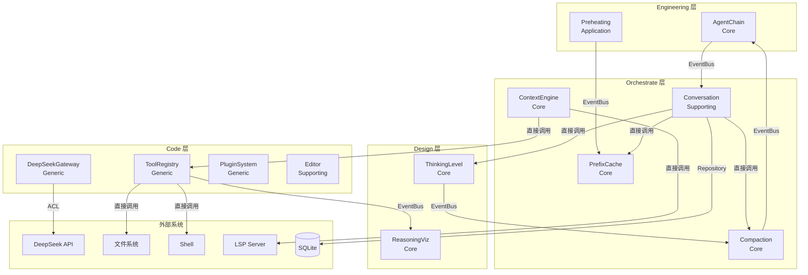

# 02 — 领域模型

> 以 DDD-DESIGN-V2 四层架构为权威，融合领域愿景中的设计原则、融合策略和统一语言。

---

## 1. 一句话

**唯一适配 DeepSeek 的开源桌面 AI 编程 IDE——用对了模型，所以每一个设计决策都不需要妥协。**

---

## 2. 我们是什么，不是什么

| 我们是 | 我们不是 |
|--------|---------|
| DeepSeek-first 的深度优化 IDE | 多模型兼容的通用客户端 |
| 开源 + 本地优先 | 闭源 + 云端绑定 |
| 极简内核 + 插件扩展 | 大而全的单体应用 |
| Agent + 编辑器一体 | 编辑器插件或终端工具 |
| 桌面 IDE（Electron + Monaco） | 终端 CLI 或 VS Code 插件 |
| 工程设计编排 IDE | 聊天工具 |

---

## 3. 融合策略

```
Pi 的基因                Reasonix 的基因            DeepCode 的基因          Cursor 的基因
──────────              ───────────────            ──────────────          ──────────────
✅ Compaction            ✅ Prefix-Cache 90%+       ✅ 多 Agent 角色         ✅ Diff Apply 体验
✅ ThinkingLevel          ✅ DeepSeek 深度适配        ✅ MCP 协议              ✅ Monaco Editor
✅ Agent-Chain YAML       ✅ Token 实时追踪           ❌ 7-Agent 固定流水线    ✅ 上下文感知 UI
✅ Event Bus              ✅ Auto 模型切换            ❌ Python               ❌ 大 System Prompt
✅ 插件体系               ✅ 工具调用修复             ❌ 无缓存优化             ❌ 闭源 + 付费
✅ 4 工具极简             ❌ 单 Agent
❌ Claude 优先            ❌ 无 Compaction
❌ 终端 only              ❌ 无 CodeRAG
```

**丢掉的东西**：Pi 的多模型适配、DeepCode 的固定 7-Agent、Cursor 的闭源/大 Prompt/Inline 补全

**我们独有的东西**：LSP + 依赖图作为代码上下文主力、Compaction + PrefixCache 协调、reasoning_content 全流程可视化、缓存预热

---

## 4. 为什么 DeepSeek-first

| 顾虑 | 回应 |
|------|------|
| 锁死供应商 | DeepSeek V4 Flash/Pro 已经是成熟产品线。Reasonix 83K stars 证明市场买单 |
| 用户要选择自由 | 选对模型的极致体验 > 所有模型都凑合 |
| Prefix-Cache 依赖 | 这正是壁垒——我们把 Compaction + PrefixCache 协调做到极致 |

DeepSeek-first 的架构红利：
- 无模型抽象层，LLM Gateway 简化 50%
- Prefix-Cache 从"优化项"升为"架构基石"
- reasoning_content 一等公民
- ThinkingLevel 直通 reasoning_effort API
- ToolCallRepair 专门针对 DeepSeek 已知问题

---

## 5. 核心设计原则

### 原则 1：极简内核 + 插件外挂

核心 < 5000 行，System prompt 叙述 < 300 tokens，10 工具（4 核心 read/write/edit/bash + 6 LSP，按 A0 §4 裁决 D-C4）。

### 原则 2：声明式 Agent-Chain

YAML 定义多 Agent 流水线。单 Agent = 1 Stage 的 Chain（统一模型）。

### 原则 3：1M 上下文是战略资源，不是垃圾桶

```
1M Token = 从容，不是浪费

  固定前缀 5-10K  ← 缓存命中基石
  精选上下文 10-50K ← LSP+CodeRAG 精准注入
  对话预算 50-200K ← 压缩后历史
  推理空间 100-500K ← Pro 模型深度思考
  安全余量 200K+   ← 大文件、工具调用结果
```

### 原则 4：代码上下文 = LSP 先行，语义兜底

```
Layer 1: LSP + 依赖图 (确定性, 70%)
  → 定义跳转、引用查找、调用链、类型信息
  → 零 token 成本，100% 准确

Layer 2: CodeRAG (语义检索, 20%)
  → 概念性查询、"类似代码在哪"、模式搜索
  → 仅在 LSP 回答不了时启用

Layer 3: Agent 自主探索 (兜底, 10%)
  → LLM 自行决定读什么文件
  → 前两层都解决不了的复杂场景
```

### 原则 5：Compaction + PrefixCache 协调

压缩会破坏缓存前缀 → 但压缩后保留最近 20 条原始消息形成新基线 → 压缩节省的 token >> 缓存重建的成本。

### 原则 6：Event Bus 唯一通信通道

Plugin ↔ Core 之间仅通过 EventBus。插件不直调核心模块。

---

## 6. 四层领域架构

```
Engineering   产品交付层   AgentChain 流水线 → DiffApply → ChangeSet 交付
   ↑ 编排
Orchestrate   Agent 协作层   Compaction · PrefixCache · ContextEngine
   ↑ 设计
Design        分析设计层   ThinkingLevel · ReasoningViz
   ↑ 编码
Code          基础能力层   Editor · ToolRegistry · DeepSeekGateway · PluginSystem
```

---

## 7. 限界上下文（4 层 16 个，对齐 A0 领域权威总纲 §2）

> ✅ **2026-08-01 内容式对齐（D-C2/D-C3/D-C8）**：本表已按 `00-domain-authority.md` §2 更新为 **16 个 BC**（原 12 个 + Workspace/ShellAgent/TokenTracker/Configuration/MCPBridge 五者）；Preheating 并入 PrefixCache 为领域服务（不再独立 BC）；类型按 A0 判定（核心=壁垒、支撑=载体、通用=设施）。实现以此表 + A0 §2 为准。

### Layer 1: Code（基础编码层）

| 限界上下文 | 类型 | 职责 | 聚合根 |
|-----------|------|------|--------|
| **ToolRegistry** | 通用域 | 工具注册、发现、执行（4 核心 + 6 LSP） | ToolRegistry |
| **DeepSeekGateway** | 通用域（防腐层） | API 通信、StreamParser、ToolCallRepair、ModelRouter、预热端口 | —（防腐层） |
| **Editor** | 支撑域 | Monaco 编辑器、DiffApply、ChangeSet | ChangeSet |
| **Workspace** | 支撑域 | 项目文件 + LSP 客户端集成、文件监听 | Workspace |
| **ShellAgent** | 支撑域 | 命令执行沙箱（Main Process） | — |

### Layer 2: Design（分析设计层）

| 限界上下文 | 类型 | 职责 | 聚合根 |
|-----------|------|------|--------|
| **ThinkingLevel** | 核心域 | 推理深度四档（none/basic/medium/high）直通 reasoning_effort | ThinkingLevel（值对象） |
| **ReasoningViz** | 核心域 | reasoning_content 结构化捕获与展示 | ReasoningCapture |

### Layer 3: Orchestrate（Agent 协作层）

| 限界上下文 | 类型 | 职责 | 聚合根 |
|-----------|------|------|--------|
| **Conversation** | 核心域 | 多轮对话聚合，承载 ThinkingLevel + PrefixState + CompactionConfig | Conversation |
| **Compaction** | 核心域 | 触发 100 条/200K，保留最近 20 条，上下文永不溢出 | CompactionService |
| **PrefixCache** | 核心域 | Append-Only + **Preheating 服务（归属此处）**，≥90% 命中率 | PrefixCacheState |
| **ContextEngine** | 核心域 | LSP → CodeRAG → Agent 三层代码上下文管线 | ContextEngine |

### Layer 4: Engineering（产品交付层）

| 限界上下文 | 类型 | 职责 | 聚合根 |
|-----------|------|------|--------|
| **AgentChain** | 核心域 | YAML 声明式流水线（6 角色/4 模板，A0 §3 规格化） | AgentChain |
| **PluginSystem** | 支撑域 | 插件注册、生命周期、事件钩子、沙箱（内置 5 插件） | PluginRegistry |

### 通用支撑（跨层）

| 限界上下文 | 类型 | 职责 | 聚合根 |
|-----------|------|------|--------|
| **TokenTracker** | 通用域 | token/缓存/费用统计（含预热命中率） | TokenTracker |
| **Configuration** | 通用域 | 用户 & 项目配置 | Configuration |
| **MCPBridge** | 通用域 | MCP 协议外部工具集成（V1 可选） | — |

---

## 8. 聚合根模型

> 示例性聚合根（3 个核心示例；16 BC 完整聚合根清单见 A0 领域权威总纲 §2——Workspace/PrefixCacheState/TokenTracker 等聚合根以 A0 为准）。

### Conversation（核心域聚合根，对齐 A0 §2）
```
Conversation
  ├── id, title, status, thinkingLevel
  ├── messages: Message[]           ← 值对象（只读）
  ├── runtimeContext: RuntimeContext ← 编辑器状态
  ├── compactionSnapshots: [...]
  └── prefixState: PrefixState
```

### AgentChain（核心域聚合根）
```
AgentChain
  ├── id, name, description
  ├── stages: ChainStage[]
  │     ├── id, name, agent, prompt
  │     ├── dependsOn: []           ← DAG 无环约束
  │     ├── tools: []
  │     └── thinkingLevel
  └── createdAt
```

### ChangeSet（支撑域聚合根）
```
ChangeSet
  ├── id, conversationId
  ├── changes: FileChange[]         ← 值对象 (只读)
  │     ├── filePath, content, diff
  │     └── status: proposed|accepted|rejected
  └── status: open|applied|rejected
```

---

## 9. 层间通信规则

```
Code ──(防腐层)──→ DeepSeek API
Code ──(EventBus)──→ Design
Design ──(EventBus)──→ Orchestrate
Orchestrate ──(EventBus)──→ Engineering

规则：
1. 上层可以依赖下层（Engineering → Orchestrate → Design → Code）
2. 下层通过 DomainEvent 通知上层（Code 发布事件，上层订阅）
3. 核心域之间通过 EventBus 通信，不直接引用
4. 通用域通过防腐层隔离外部 API
```

---

## 10. 不变性规则

| 层 | 规则 |
|----|------|
| Code | 未授权 Plugin 操作 → SecurityError |
| Design | ThinkingLevel 映射必须 1:1 对应 reasoning_effort |
| Orchestrate | Conversation 压缩保留最近 20 条 |
| Orchestrate | PrefixCache 预热仅 idle 状态执行 |
| Orchestrate | ContextEngine LSP 已充分 → 不进 CodeRAG |
| Engineering | AgentChain dependsOn 有向无环 |
| Engineering | 上游 Stage 失败 → 下游自动 Skip |

---

## 11. Ubiquitous Language

| 术语 | 英文 | 定义 | 隐含状态 |
|------|------|------|----------|
| 对话压缩 | Compaction | 早期消息→结构化摘要，上下文永不溢出 | 是（空闲 → 触发中 → 已完成） |
| 推理深度 | ThinkingLevel | none/basic/medium/high，映射到 reasoning_effort | — |
| 代理链 | Agent Chain | YAML 声明式多 Agent 流水线 | 是（已加载 → 运行中 → 已完成/失败） |
| 上下文引擎 | ContextEngine | LSP 层 → CodeRAG 层 → Agent 探索层的三级上下文管线 | 是（Layer1→Layer2→Layer3 逐层降级） |
| 前缀缓存 | Prefix Cache | Append-only + 预热，≥90% 命中率 | 是（idle → warming → ready → broken） |
| 缓存预热 | Preheating | 打开项目时后台虚拟请求预填缓存 | 是（idle → warming → ready） |
| 推理可视化 | ReasoningViz | reasoning_content 的结构化展示 | — |
| 4 工具 | 4 Tools | read / write / edit / bash | — |
| 10 工具 | 10 Tools | 4 核心 + 6 LSP（find_definition/find_references/get_imports/get_call_chain/get_type_info/get_diagnostics），按 A0 §4 裁决 D-C4 | — |
| 精筛器 | CodeRAG | 降级为 Layer 2 语义搜索，不再是主力 | — |
| 改动暂存 | Staging | ✓ 接受的改动暂存于本地，Write 时原子 apply | 是（暂存 → 已写入） |
| 搭档须知 | Partner Rules | `.neonforge` 文件中的项目约定，搭档每次分析自动读取 | — |

---

## 12. 命令清单（Commands）

基于产品设计规范 D0 提取的用户/系统动作：

| 命令 | 触发者 | 效果 |
|------|--------|------|
| `CreateProject` | 用户 | 打开已有项目或从零构建 |
| `SendInstruction` | 用户 | 向搭档发出指令，触发分析 |
| `ContinueExecution` | 用户 | 确认分析方案，继续执行 |
| `AdjustPlan` | 用户 | 调整分析方案，重新分析 |
| `AcceptChange` | 用户 | ✓ 接受单处改动，暂存 |
| `RejectChange` | 用户 | ✗ 拒绝单处改动 |
| `AnnotateChange` | 用户 | 批注改动，搭档按批注重改 |
| `AcceptAllAndWrite` | 用户 | 全部接受并原子写入文件 |
| `WriteStagedChanges` | 用户 | 逐处审完，确认写入 |
| `CancelTask` | 用户 | 取消任务，丢弃未写入改动 |
| `CreateNewTask` | 用户 | 创建新任务，加入串行队列 |
| `SwitchTask` | 用户 | 切换到其他任务查看/审核 |
| `SetThinkingLevel` | 用户 | 调整推理深度 (none/basic/medium/high) |
| `InvokeTool` | 搭档 | 调用工具 (read/write/edit/bash/LSP) |
| `StartPreheating` | 系统 | 项目打开时自动预热缓存 |
| `TriggerCompaction` | 系统 | 消息超过 100 条 / 200K tokens 自动压缩 |

---

## 13. 外部系统（External Systems）

| 外部系统 | 关系类型 | 说明 |
|---------|---------|------|
| **DeepSeek API** | 防腐层（ACL） | 通过 DeepSeekGateway 隔离。PrefixCache + reasoning_content 依赖 |
| **文件系统** | 直接依赖 | read/write/edit 操作本地文件 |
| **Shell/Terminal** | 直接依赖 | bash 命令执行 |
| **LSP Server** | 直接依赖 | 语言服务器，提供定义跳转、引用查找等 |
| **SQLite** | 直接依赖 | 对话持久化 |
| **Git** | 间接依赖 | Worktree 隔离（V2） |
| **MCP Server** | 防腐层（ACL） | 外部 MCP 工具集成（V2） |

---

## 14. 上下文映射图（Context Mapping）



**关系说明：**

| 关系 | 含义 |
|------|------|
| 直接调用 | 上层直接依赖下层接口 |
| EventBus | 领域事件异步通信，松耦合 |
| ACL（防腐层） | 隔离外部 API 变化，保护领域模型 |
| Repository | 持久化端口，定义在领域层，实现在基础设施层 |

---

## 15. DDD 方法论对齐检查

对照 DDD 五步法（统一语言 → 事件风暴 → 战略设计 → 战术设计 → 架构）：

| 步骤 | 对应文档 | 完整度 |
|------|---------|--------|
| 1. 统一语言 | §11（本文件）+ §4 核心原则 | ✓ |
| 2. 事件风暴（事件） | `06-domain-events.md` — 9 组完整事件目录 | ✓ |
| 2. 事件风暴（命令） | §12（本文件）— 16 个命令 | ✓ |
| 2. 事件风暴（外部系统） | §13（本文件）— 7 个外部系统 | ✓ |
| 3. 战略设计（BC 划分） | `03-strategic-design.md` — 14 个 BC（三层） + §6-7（本文件）— 12 个 BC（四层权威） | ✓ |
| 3. 战略设计（映射图） | §14（本文件）— Mermaid 上下文映射 | ✓ |
| 4. 战术设计（聚合） | `04-tactical-design.md` — 6 聚合根 + 值对象 + 领域服务 | ✓ |
| 4. 战术设计（不变量） | §10（本文件）+ `04-tactical-design.md` §5 | ✓ |
| 5. 架构 | `05-architecture.md` — 分层架构 + 管线 + 选型 | ✓ |
