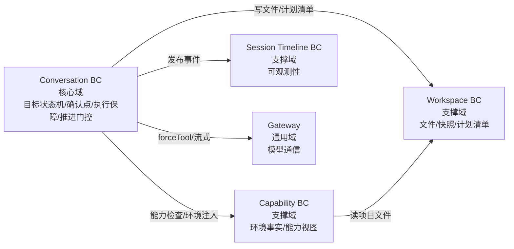

# 03 — 战略设计（无阶段·目标驱动版）

> 2026-08-07 重新生成——限界上下文划分与核心域声明，基于无阶段目标驱动领域模型（02 领域模型）。
> 替代旧六阶段版（Compaction/AgentChain/ContextEngine 等围绕产品流水线的 BC 划分）。

## 1. 限界上下文全景

```
┌────────────────────────────────────────────────────────────────────────┐
│                      NeonForge 搭档 领域全景（无阶段·目标驱动）              │
│                                                                        │
│  ┌────────────────────────────────────────────────────────────────┐    │
│  │              Conversation BC（核心域）——目标驱动主战场              │    │
│  │  · 目标状态机（Goal → Execution → Achievement）                  │    │
│  │  · 确认点（目标/执行/达成——用户确认=推进门槛）                      │    │
│  │  · 执行保障策略（TurnExecutionPolicy——forceTool）               │    │
│  │  · 推进门控（ProgressionGate——模型活动边界）                      │    │
│  │  · 模型活动边界（确认点未确认 → 停在该确认点）                      │    │
│  └────────────────────────────────────────────────────────────────┘    │
│                            │ 依赖                                     │
│  ┌──────────────┐  ┌───────┴──────┐  ┌──────────────────┐             │
│  │ Capability BC │  │ Workspace BC  │  │ Session Timeline  │             │
│  │（支撑域）      │  │（支撑域）      │  │ BC（支撑域）        │             │
│  │ 环境检测(事实) │  │ 项目文件       │  │ 全步骤统一记录      │             │
│  │ 能力视图(推导) │  │ 快照/回滚      │  │（可观测性）        │             │
│  │ 能力检查       │  │ 计划清单(批准)  │  └──────────────────┘             │
│  └──────────────┘  └──────────────┘                                    │
└────────────────────────────────────────────────────────────────────────┘
```

## 2. 核心域声明：Conversation BC（目标驱动）

**为什么是核心域**：搭档的差异化价值 = 目标驱动的执行（确认驱动推进、防只说不做、宿主强制边界）——这是与其它工具/代理区别的壁垒。

**核心职责**：

| 职责 | 说明 |
|------|------|
| 目标状态机 | Goal → Execution → Achievement——三个确认点驱动状态转换 |
| 确认点管理 | 目标/执行/达成三处用户确认——结构化确认卡（确认/拒绝）|
| 执行保障 | 确认后防只说不做（forceTool）；失败释放（诊断修正）；任务完成度（计划写完/达成确认释放）|
| 推进门控 | 确认点未确认 → 模型活动边界限制在该确认点（不越级推进）|
| 宿主强制边界 | 计划清单（写文件边界）+ 拒绝回填边界（模型回到边界内）|

**核心域衡量指标**：目标确认到执行确认的转化率（用户是否理解并确认）；执行确认到产出率（确认后是否真正产出）；达成确认率（用户是否认可完成）。

## 3. 支撑域

### 3.1 Capability BC（能力/环境）

**职责**：
- 环境检测（事实来源）——一次检测（runtime/依赖/工具链/宿主 runtime）
- 能力视图（从环境推导——ready/missing/failed——不独立二次检测）
- 能力检查（模型/系统查询能力状态）
- Ledger 回填（执行结果 → 能力状态自学习）

**与 Conversation 的关系**：Conversation 在确认点后调用能力检查（确认目标 → 检查达成目标所需能力 → 给方案）；环境快照注入系统提示（模型开箱即知）。

### 3.2 Workspace BC（工作区）

**职责**：
- 项目文件操作（read/write/edit）
- 写入快照/回滚（安全闭环）
- 计划清单（plan_approval 批准文件集合——宿主强制边界的数据源）

**与 Conversation 的关系**：Conversation 的推进门控读取计划清单（写文件边界）；写操作经 Workspace 执行（快照/回滚）。

### 3.3 Session Timeline BC（会话时间线）

**职责**：单会话所有步骤统一记录（用户/搭档/工具/授权/确认/状态——时间顺序完整）——可观测性（分析一步到位、断点续做、审计）。

**与 Conversation 的关系**：Conversation 所有状态转换/工具执行发布事件 → Timeline 记录。

## 4. 通用域

| BC | 职责 |
|----|------|
| Gateway（模型网关）| DeepSeek API 通信、流式解析、forceTool 传递、工具调用修复 |
| ToolRegistry（工具注册）| 工具注册、发现、执行分发（read/write/edit/bash/check-capability/plan_approval…）|
| Configuration | 用户与项目配置 |

## 5. 上下文映射

| 关系 | 模式 | 说明 |
|------|------|------|
| Conversation → Capability | 调用（OHS）| 确认目标后调能力检查；环境快照注入 |
| Conversation → Workspace | 调用（OHS）| 写文件经 Workspace（快照/回滚）；计划清单读取 |
| Conversation → Timeline | 发布事件 | 所有状态转换/工具执行发布 |
| Conversation → Gateway | 调用 | forceTool 传递、流式对话 |
| Capability → Workspace | 调用 | 环境检测读项目文件 |



## 6. 核心域演进方向

1. **确认点扩展**：能力缺失/装依赖等决策点结构化（当前对话式 → 确认卡）
2. **推进门控强化**：确认点未确认的模型活动边界细化（每确认点的允许动作清单）
3. **执行保障自适应**：forceTool 决策从规则演进到任务级自适应（模型行为历史）
4. **宿主边界可配置**：计划清单粒度（文件级 → 目录级 → 工具级——用户可调）

---

**下一步**: [04-战术设计](./04-tactical-design.md)
