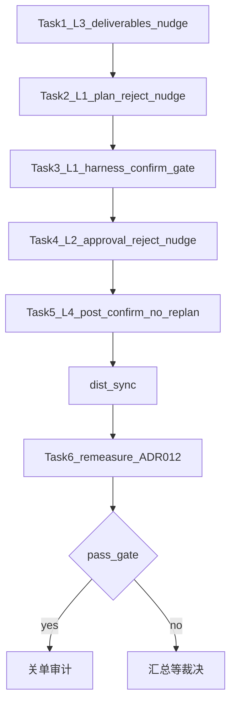

# 人格池叶因 L1–L4 修批方案

> **For agentic workers:** REQUIRED WORKFLOW: implement this plan task-by-task — either dispatch a fresh subagent per task with a review gate between tasks (recommended), or execute inline with checkpoints. Steps use checkbox (`- [ ]`) syntax for tracking.

**Goal:** 针对测批 RCA 叶因 L1–L4，使 `NF_UAT_SEED=pilot30` 抽 12 达到关单硬闸（resolved≥10/12 且零 `stuck_*`/`timeout`），且 `run-uat-tiers.sh` T1–T4 全绿。

**Architecture:** 产品侧补齐「拒方案后收敛 / 拒授权后恢复 / 交付后必 report / 确认后禁再规划」四条 silent nudge（每会话有限次，不恢复 `tool_choice:required`）；harness 侧把 `planConfirmed` 改成以 timeline `task.execution_confirmed` 为准，拒满后抑制澄清冲掉 plan 门。整批修完再 **一次** 复测（ADR-012）。

**Tech Stack:** Electron/React · `agentLoop.ts` nudge · `ConversationPanel.tsx` 接线 · `scripts-cdp/uat-lib.mjs` · Vitest L1 · Mac dist · ADR-012

**权威证据：** [`docs/audits/uat-persona-pool-rca-2026-09-30.md`](../../audits/uat-persona-pool-rca-2026-09-30.md)（测批 [`uat-persona-pool-testbatch-2026-09-30.md`](../../audits/uat-persona-pool-testbatch-2026-09-30.md)）

## Global Constraints

- ADR-012：修批与复测分离；本方案 Tasks 1–5 为处置轮；Task 6 为复测只记；未达标 → 汇总等裁决，禁止测中连修
- 不改 ADR-011；不拆 unverifiable；**不恢复** `tool_choice:required`
- 新/加强 nudge：一律 `silent: true`；每会话有限次（见各 Task）；禁止加大 `maxRounds` 熬绿
- 不得缩池 / 去掉分层 `rejectPlan` / 取消 `refuse_once` 人格装绿
- 关单硬闸：pilot30 **pass≥10/12** 且结果中 **零** `stuck_*` 与 **零** `timeout`；非收口例外最多 2 且仅 `config`/`web_env`
- Task 6 前必须跑通 `run-uat-tiers.sh`（共享 autopilot 防误杀）；D-network / L3 / npm e2e **不在**本方案关单
- 实施时 **不要编辑本 plan 文件**（勾选由执行者本地记，或审计回写另文）



## 叶因 → 任务映射

| 叶因 | 本批命中 | Task | 修向 |
|------|----------|------|------|
| **L3** P0 | p091 | Task 1 | deliverables nudge 扩到 2 次 + bash 已执行后仍可催 |
| **L1** P0 | p002/p068/p114/p042/p055 | Task 2 + 3 | 拒方案 nudge 按拒次配额；拒满后 harness 以 timeline 确认 + 抑制澄清冲门 |
| **L2** P1 | p087 | Task 4 | approval reject 后催再批或改道 report |
| **L4** P1 | T3 | Task 5 | 确认后若再 `propose_plan`/催点卡 → 催 write |

**不做：** 放宽 tag 断言；改人格池 schema 去掉极端档；用 timeout 充环境例外。

## File Structure

| 文件 | 职责 |
|------|------|
| `apps/desktop/src/domain/agentLoop.ts` | 纯函数 nudge（L1/L2/L3/L4） |
| `apps/desktop/tests/unit/agentLoop.test.ts` | L1 单测 |
| `apps/desktop/src/renderer/ConversationPanel.tsx` | 接线 refs + silent send |
| `apps/desktop/scripts-cdp/uat-lib.mjs` | `planConfirmed`←timeline；拒满后 clarify 门控 |
| `docs/audits/uat-persona-pool-leaf-remeasure-*.md` | Task 6 只记汇总 |

---

### Task 1 — L3：交付后必催 report（扩配额）

**Files:**
- Modify: `apps/desktop/src/domain/agentLoop.ts`（`shouldNudgeReportAfterDeliverables`）
- Modify: `apps/desktop/src/renderer/ConversationPanel.tsx`（`deliverablesReportNudgedRef` → count）
- Test: `apps/desktop/tests/unit/agentLoop.test.ts`

**Interfaces:**
- Consumes: 现有 `shouldNudgeReportAfterDeliverables` 调用点（`planConfirmed` / `producedCount` / `toolNamesThisTurn`）
- Produces: `shouldNudgeReportAfterDeliverables(input: { planConfirmed: boolean; pending: string; producedCount: number; nudgeCount?: number; alreadyNudged?: boolean; maxNudges?: number; bashExecutedSinceProduce?: boolean; toolNamesThisTurn: string[] }): { nudge: false } | { nudge: true; message: string }`

**Why：** p091 已 write+bash 成功却无 `report_completion`；现 `alreadyNudged` 单次且仅纯文本窗偶发错过。对齐 evidence 路径：最多 2 次；bash 已执行后第二次更硬。

- [ ] **Step 1: Write the failing tests**

在 `agentLoop.test.ts` 的 `shouldNudgeReportAfterDeliverables` describe 内追加：

```ts
it('nudgeCount=1 + bashExecutedSinceProduce + 纯文本 → 二次催', () => {
  const r = shouldNudgeReportAfterDeliverables({
    ...base,
    nudgeCount: 1,
    bashExecutedSinceProduce: true,
  })
  expect(r.nudge).toBe(true)
  if (r.nudge) {
    expect(r.message).toContain('report_completion')
    expect(r.message).toMatch(/已执行|核验/)
  }
})
it('nudgeCount=2 → 不催', () => {
  expect(
    shouldNudgeReportAfterDeliverables({
      ...base,
      nudgeCount: 2,
      bashExecutedSinceProduce: true,
    }).nudge,
  ).toBe(false)
})
it('兼容 alreadyNudged=true（无 nudgeCount）→ 不走首次', () => {
  expect(shouldNudgeReportAfterDeliverables({ ...base, alreadyNudged: true }).nudge).toBe(false)
})
```

- [ ] **Step 2: Run test to verify it fails**

Run（cwd `apps/desktop`）:

```bash
npx vitest run tests/unit/agentLoop.test.ts -t "shouldNudgeReportAfterDeliverables"
```

Expected: FAIL（新用例未实现 / 签名无 `nudgeCount`）

- [ ] **Step 3: Minimal implementation**

替换 `shouldNudgeReportAfterDeliverables` 为：

```ts
export function shouldNudgeReportAfterDeliverables(input: {
  planConfirmed: boolean
  pending: string
  producedCount: number
  /** @deprecated 用 nudgeCount；true 等价 nudgeCount>=1 且无二次路径 */
  alreadyNudged?: boolean
  nudgeCount?: number
  maxNudges?: number
  /** 产出后曾成功执行 bash（核验） */
  bashExecutedSinceProduce?: boolean
  toolNamesThisTurn: string[]
}): { nudge: false } | { nudge: true; message: string } {
  const maxNudges = input.maxNudges ?? 2
  const nudgeCount = input.nudgeCount ?? (input.alreadyNudged ? 1 : 0)
  if (
    !input.planConfirmed ||
    input.pending !== 'none' ||
    input.producedCount < 1 ||
    nudgeCount >= maxNudges
  )
    return { nudge: false }
  if (input.toolNamesThisTurn.includes('report_completion')) return { nudge: false }
  if (input.toolNamesThisTurn.some((n) => n === 'write' || n === 'edit')) return { nudge: false }
  if (nudgeCount === 0) {
    return {
      nudge: true,
      message:
        '【系统提示·非用户发言】规划文件已写入。请立即调用 report_completion（verification 用已执行的只读 shell 命令与真实 stdout）；不要只用文字声称完成或再要用户点授权。',
    }
  }
  if (!input.bashExecutedSinceProduce) return { nudge: false }
  if (input.toolNamesThisTurn.length > 0 && !input.toolNamesThisTurn.every((n) => n === 'bash'))
    return { nudge: false }
  if (input.toolNamesThisTurn.length > 0) return { nudge: false }
  return {
    nudge: true,
    message:
      '【系统提示·非用户发言】文件已写入且核验命令已执行。请立即调用 report_completion，把该 command 与真实 stdout 填进 verification；不要再用文字拖延或要授权。',
  }
}
```

`ConversationPanel.tsx`：把 `deliverablesReportNudgedRef` 改为 `deliverablesReportNudgeCountRef`（number，会话重置为 0）；调用传入 `nudgeCount`；成功催则 `+= 1`。另加 `bashExecutedSinceProduceRef`：在 tool done 且 `name==='bash' && ok` 且 `producedFiles.size>0` 时置 `true`；会话/resolution 重置清零。

- [ ] **Step 4: Run tests to verify pass**

```bash
npx vitest run tests/unit/agentLoop.test.ts -t "shouldNudgeReportAfterDeliverables"
```

Expected: PASS（含旧用例：`alreadyNudged` 兼容；本轮 bash 首次仍可催——保留现有 `toolNamesThisTurn: ['bash']` → true 行为：首次 `nudgeCount===0` 不要求纯文本）

- [ ] **Step 5: Commit**

```bash
git add apps/desktop/src/domain/agentLoop.ts \
  apps/desktop/src/renderer/ConversationPanel.tsx \
  apps/desktop/tests/unit/agentLoop.test.ts
git commit -m "$(cat <<'EOF'
fix(uat): strengthen deliverables→report nudge for L3

EOF
)"
```

**Done when:** L1 单测绿；p091 类「有产出+bash 已执行」二次仍可催 report。

---

### Task 2 — L1 产品：拒方案后按拒次收敛催 propose_plan

**Files:**
- Modify: `apps/desktop/src/domain/agentLoop.ts`（`shouldNudgeProposeAfterPlanReject`）
- Modify: `apps/desktop/src/renderer/ConversationPanel.tsx`（拒次计数 + nudgeCount）
- Test: `apps/desktop/tests/unit/agentLoop.test.ts`

**Interfaces:**
- Consumes: `planWasRejectedRef`；plan reject 回调已置位
- Produces: `shouldNudgeProposeAfterPlanReject(input: { goalConfirmed: boolean; planConfirmed: boolean; pending: string; planWasRejected: boolean; planRejectCount: number; nudgeCount?: number; alreadyNudged?: boolean; maxNudges?: number; toolNamesThisTurn: string[] }): …`

**Why：** 双拒后进 ask_user/clarify，现 nudge 仅 1 次且在 `pending!=='none'` 时整段静默；拒满后仍缺「禁止再 clarify、必须 propose_plan」的硬催。

- [ ] **Step 1: Write the failing tests**

```ts
it('planRejectCount>=2 + nudgeCount=1 + 纯文本 → 二次收敛催（禁 ask_user）', () => {
  const r = shouldNudgeProposeAfterPlanReject({
    ...base,
    planRejectCount: 2,
    nudgeCount: 1,
  })
  expect(r.nudge).toBe(true)
  if (r.nudge) {
    expect(r.message).toContain('propose_plan')
    expect(r.message).toMatch(/不要再|ask_user|澄清/)
  }
})
it('planRejectCount=1 + nudgeCount=1 → 不二次（未满双拒）', () => {
  expect(
    shouldNudgeProposeAfterPlanReject({ ...base, planRejectCount: 1, nudgeCount: 1 }).nudge,
  ).toBe(false)
})
it('nudgeCount=2 → 不催', () => {
  expect(
    shouldNudgeProposeAfterPlanReject({
      ...base,
      planRejectCount: 2,
      nudgeCount: 2,
    }).nudge,
  ).toBe(false)
})
```

保留原「首次拒 → 催」用例；`base` 补 `planRejectCount: 1`。

- [ ] **Step 2: Run — expect FAIL**

```bash
npx vitest run tests/unit/agentLoop.test.ts -t "shouldNudgeProposeAfterPlanReject"
```

- [ ] **Step 3: Minimal implementation**

```ts
export function shouldNudgeProposeAfterPlanReject(input: {
  goalConfirmed: boolean
  planConfirmed: boolean
  pending: string
  planWasRejected: boolean
  planRejectCount: number
  alreadyNudged?: boolean
  nudgeCount?: number
  maxNudges?: number
  toolNamesThisTurn: string[]
}): { nudge: false } | { nudge: true; message: string } {
  const maxNudges = input.maxNudges ?? 2
  const nudgeCount = input.nudgeCount ?? (input.alreadyNudged ? 1 : 0)
  if (
    !input.goalConfirmed ||
    input.planConfirmed ||
    input.pending !== 'none' ||
    !input.planWasRejected ||
    nudgeCount >= maxNudges
  )
    return { nudge: false }
  if (input.toolNamesThisTurn.includes('propose_plan')) return { nudge: false }
  if (input.toolNamesThisTurn.length > 0) return { nudge: false }
  if (nudgeCount === 0) {
    return {
      nudge: true,
      message:
        '【系统提示·非用户发言】方案已被拒绝且尚未确认。请立即调用 propose_plan 提交修订后的执行方案（吸收用户反馈）；用户确认执行并完成后调用 report_completion——不要只用文字描述方案。',
    }
  }
  // 二次：至少拒满 2 次仍未确认 → 收敛（禁止再开澄清）
  if (input.planRejectCount < 2) return { nudge: false }
  return {
    nudge: true,
    message:
      '【系统提示·非用户发言】方案已被拒绝两次仍未确认。请立即调用 propose_plan 提交可执行的最终方案（files+summary）；不要再调用 ask_user 或文字澄清——等用户点「确认执行」。',
  }
}
```

接线：新增 `planRejectCountRef`（每次 pendingKind==='plan' 拒绝或「修改方案」路径 `+=1`）；`planRejectNudgeCountRef`；调用传 `planRejectCount` / `nudgeCount`。确认执行成功时两 ref 可保留至会话重置（不影响，因 `planConfirmed` 门已关）。

- [ ] **Step 4: Run — expect PASS**

```bash
npx vitest run tests/unit/agentLoop.test.ts -t "shouldNudgeProposeAfterPlanReject"
```

- [ ] **Step 5: Commit**

```bash
git add apps/desktop/src/domain/agentLoop.ts \
  apps/desktop/src/renderer/ConversationPanel.tsx \
  apps/desktop/tests/unit/agentLoop.test.ts
git commit -m "$(cat <<'EOF'
fix(uat): converge propose_plan nudge after double plan reject

EOF
)"
```

**Done when:** 双拒后仍有第二次 silent 收敛催；单拒不误二次。

---

### Task 3 — L1 harness：timeline 确认门 + 拒满后抑制澄清冲门

**Files:**
- Modify: `apps/desktop/scripts-cdp/uat-lib.mjs`（`autopilot` / 可选小辅助）
- 不改产品断言；不改人格 `rejectPlan` 配额

**Interfaces:**
- Consumes: 已有 `readLatestTimeline()` / `timelineWatermark()`（同文件，读 Mac UD `timeline-*.jsonl`）
- Produces: `function domainPlanConfirmedSince(sinceSeq: number): boolean` — `true` iff `readLatestTimeline()` 中存在 `seq > sinceSeq && type === 'task.execution_confirmed'`

**Why：** RCA：harness 日志「确认执行」与 UD 无 `execution_confirmed` 不一致 → 假 `planConfirmed` 武装 interrupt / 早停逻辑错位；拒满后 clarify/type-ask 冲掉收敛窗。

- [ ] **Step 1: Add helper（紧接 `timelineWatermark`）**

```js
/** 自 watermark 起是否已有领域方案确认（勿用按钮点击冒充） */
export function domainPlanConfirmedSince(sinceSeq) {
  return readLatestTimeline().some(
    (e) => e.seq > sinceSeq && e.type === 'task.execution_confirmed',
  )
}
```

**禁止**新造 `window.__NF_TIMELINE__` 等第二事件源。

- [ ] **Step 2: 改 autopilot 内 `planConfirmed` 赋值**

凡 `acted.includes('确认执行')` / `button:确认执行` 处：

```js
// 点击后短等，再以领域事件为准（startSeq 已在 autopilot 开头取 watermark）
await page.waitForTimeout(800)
planConfirmed = domainPlanConfirmedSince(startSeq)
if (!planConfirmed) {
  console.log(`  r${r}: click-confirm-exec but no task.execution_confirmed yet`)
}
```

禁止：`planConfirmed = true` 仅因点击成功。每轮 loop 开头也可：`if (!planConfirmed) planConfirmed = domainPlanConfirmedSince(startSeq)`（覆盖异步落盘延迟）。

- [ ] **Step 3: 拒满后抑制澄清冲门**

在 candidate / type-ask 分支前加：

```js
const rejectQuotaDone =
  (persona.rejectPlan || 0) > 0 &&
  (persona.__planRejects || 0) >= (persona.rejectPlan || 0)
// 拒满且尚未领域确认：优先等方案卡；每轮最多再答 1 次澄清，且总 clarifyAnswerCount 上限从 3 降为 1（仅本条件）
const clarifyCap = rejectQuotaDone && !planConfirmed ? 1 : 3
```

将 `clarifyAnswerCount < 3` 改为 `clarifyAnswerCount < clarifyCap`。  
拒满且 `!planConfirmed` 时：**跳过** `__ask_typed__` / `__ask_typed_2__` 新开 type-ask（仍允许点已有「确认执行」）。

拒满且 idleRounds===3 且无方案卡时：保留/强化现有 `__nudge_propose_plan__` / `__nudge_repropose__`（文案可改为与产品二次收敛同义，仍走 silent 系统提示句式）。

- [ ] **Step 4: Smoke（本机或 Mac，不跑满池）**

```bash
# 含 rejectPlan=2 的 legacy picky 或池内一条
NF_UAT_SEED=pilot30 # 仅烟测一条双拒人格即可
# 例：npx 跑 uat-G-persona --from-pool <双拒 id> 或 scripts 已有 picky 烟测入口
```

Expected：动作日志若出现 `button:确认执行`，同轮后 timeline 必有 `task.execution_confirmed`，或日志明确 `no task.execution_confirmed yet` 且 **不** 把 `planConfirmed` 置真。

- [ ] **Step 5: Commit**

```bash
git add apps/desktop/scripts-cdp/uat-lib.mjs
git commit -m "$(cat <<'EOF'
fix(uat): gate harness planConfirmed on timeline execution_confirmed

EOF
)"
```

**Done when:** 假确认消失；双拒人格拒满后不再用 3 次澄清打散 propose 窗。

---

### Task 4 — L2：拒授权后恢复催

**Files:**
- Create（逻辑在既有文件）: `shouldNudgeAfterApprovalReject` in `agentLoop.ts`
- Modify: `ConversationPanel.tsx`
- Test: `agentLoop.test.ts`

**Interfaces:**
- Consumes: 授权卡 reject 路径（与 plan reject 对称置 `approvalWasRejectedRef`）
- Produces: `shouldNudgeAfterApprovalReject(input: { planConfirmed: boolean; pending: string; approvalWasRejected: boolean; alreadyNudged: boolean; toolNamesThisTurn: string[] }): { nudge: false } | { nudge: true; message: string }`

**Why：** p087：`refuse_once` 拒 bash 后无再申请/无改道 report；harness 下轮已会允许，缺产品推进。

- [ ] **Step 1: Failing tests**

```ts
describe('shouldNudgeAfterApprovalReject', () => {
  const base = {
    planConfirmed: true,
    pending: 'none',
    approvalWasRejected: true,
    alreadyNudged: false,
    toolNamesThisTurn: [] as string[],
  }
  it('拒过授权 + 纯文本 → 催再调工具或 report', () => {
    const r = shouldNudgeAfterApprovalReject(base)
    expect(r.nudge).toBe(true)
    if (r.nudge) {
      expect(r.message).toMatch(/授权|approval|允许/)
      expect(r.message).toContain('report_completion')
    }
  })
  it('未拒过 → 不催', () => {
    expect(shouldNudgeAfterApprovalReject({ ...base, approvalWasRejected: false }).nudge).toBe(
      false,
    )
  })
  it('本轮已有工具 → 不催', () => {
    expect(
      shouldNudgeAfterApprovalReject({ ...base, toolNamesThisTurn: ['bash'] }).nudge,
    ).toBe(false)
  })
  it('已催 → 不催', () => {
    expect(shouldNudgeAfterApprovalReject({ ...base, alreadyNudged: true }).nudge).toBe(false)
  })
})
```

- [ ] **Step 2: Run — FAIL**

```bash
npx vitest run tests/unit/agentLoop.test.ts -t "shouldNudgeAfterApprovalReject"
```

- [ ] **Step 3: Implement + wire**

```ts
export function shouldNudgeAfterApprovalReject(input: {
  planConfirmed: boolean
  pending: string
  approvalWasRejected: boolean
  alreadyNudged: boolean
  toolNamesThisTurn: string[]
}): { nudge: false } | { nudge: true; message: string } {
  if (
    !input.planConfirmed ||
    input.pending !== 'none' ||
    !input.approvalWasRejected ||
    input.alreadyNudged ||
    input.toolNamesThisTurn.length > 0
  )
    return { nudge: false }
  return {
    nudge: true,
    message:
      '【系统提示·非用户发言】上一工具授权已被拒绝。请改用无需高风险授权的只读核验，或再次请求授权后继续；有产出则立即调用 report_completion——不要停在文字说明。',
  }
}
```

接线：在授权 reject 回调置 `approvalWasRejectedRef=true`；在 `planConfirmed && pending==='none' && !toolCalls` 链上，**在** deliverables / evidence nudge 之前或之后（建议：evidence 之后、StuckDetector 之前）调用；每会话最多 1 次（`approvalRejectNudgedRef`）。

**禁止：** 改 harness 取消 `refuse_once`；改人格池去掉该档。

- [ ] **Step 4: PASS + Commit**

```bash
npx vitest run tests/unit/agentLoop.test.ts -t "shouldNudgeAfterApprovalReject"
git add apps/desktop/src/domain/agentLoop.ts \
  apps/desktop/src/renderer/ConversationPanel.tsx \
  apps/desktop/tests/unit/agentLoop.test.ts
git commit -m "$(cat <<'EOF'
fix(uat): nudge recovery after approval reject for L2

EOF
)"
```

**Done when:** 拒授权后纯文本收尾必有一次 silent 恢复催。

---

### Task 5 — L4：确认后禁再规划（扩 write nudge）

**Files:**
- Modify: `shouldNudgeWriteAfterPlanConfirm` in `agentLoop.ts`
- Modify: `ConversationPanel.tsx`（传入本轮是否曾 `propose_plan`）
- Test: `agentLoop.test.ts`

**Interfaces:**
- Produces: 扩展 input：`reproposedPlanThisTurn?: boolean`；当 `planConfirmed && (asksClickConfirm || reproposedPlanThisTurn)` 且纯文本/`propose_plan` 刚完成的下一判定窗 → 催 write

**Why：** T3：`execution_confirmed` 后 force 下仍 `propose_plan`；现 nudge 只匹配「催点确认执行」文案。

- [ ] **Step 1: Failing tests**

```ts
it('方案已确认 + 本轮曾 propose_plan + 随后纯文本 → 催 write', () => {
  const r = shouldNudgeWriteAfterPlanConfirm({
    ...base,
    assistantContent: '我再规划一下文件清单。',
    reproposedPlanThisTurn: true,
  })
  expect(r.nudge).toBe(true)
  if (r.nudge) expect(r.message).toContain('write')
})
it('方案已确认 + 普通分析 + 未再 propose → 仍不催', () => {
  expect(
    shouldNudgeWriteAfterPlanConfirm({
      ...base,
      assistantContent: '我先看一下目录结构再动手。',
      reproposedPlanThisTurn: false,
    }).nudge,
  ).toBe(false)
})
```

- [ ] **Step 2: FAIL → Step 3: Implement**

```ts
export function shouldNudgeWriteAfterPlanConfirm(input: {
  planConfirmed: boolean
  pending: string
  alreadyNudged: boolean
  toolNamesThisTurn: string[]
  assistantContent: string
  /** 本轮（或紧邻上一工具轮）在已确认后再次 propose_plan */
  reproposedPlanThisTurn?: boolean
}): { nudge: false } | { nudge: true; message: string } {
  if (
    !input.planConfirmed ||
    input.pending !== 'none' ||
    input.alreadyNudged ||
    input.toolNamesThisTurn.some((n) => n === 'write' || n === 'edit')
  )
    return { nudge: false }
  const t = String(input.assistantContent ?? '')
  const asksClickConfirm =
    /点[^。\n]{0,24}确认执行|确认执行[^。\n]{0,12}按钮|文字回复[^。\n]{0,20}不算|只有[^。\n]{0,16}按钮[^。\n]{0,16}授权|就等你[^。\n]{0,12}点/.test(
      t,
    )
  const reproposed = !!input.reproposedPlanThisTurn
  if (!asksClickConfirm && !reproposed) return { nudge: false }
  // 本轮仅剩 propose_plan 也视为需打断（done 时 toolNames 可能仍含 propose_plan）
  if (
    input.toolNamesThisTurn.length > 0 &&
    !reproposed &&
    !input.toolNamesThisTurn.every((n) => n === 'propose_plan')
  )
    return { nudge: false }
  return {
    nudge: true,
    message:
      '【系统提示·非用户发言】执行方案已确认，无需再 propose_plan 或催点「确认执行」。请立即调用 write/edit 写入规划文件；不要重新规划。',
  }
}
```

接线：`planConfirmed` 为真时，若 `toolCalls` 含 `propose_plan`，置 `reproposedPlanAfterConfirmRef=true`；调用 write nudge 时传入；成功催后 `planConfirmWriteNudgedRef=true` 并可选清 reproposed ref。

**禁止：** 恢复 API `tool_choice:required`；在 protocol 层硬拒一切确认后 `propose_plan`（幂等覆盖仍合法——只 nudge 催写，不 ban 工具）。

- [ ] **Step 4: PASS**

```bash
npx vitest run tests/unit/agentLoop.test.ts -t "shouldNudgeWriteAfterPlanConfirm"
npx tsc -p tsconfig.json --noEmit && npx tsc -p tsconfig.main.json --noEmit
```

- [ ] **Step 5: Commit**

```bash
git add apps/desktop/src/domain/agentLoop.ts \
  apps/desktop/src/renderer/ConversationPanel.tsx \
  apps/desktop/tests/unit/agentLoop.test.ts
git commit -m "$(cat <<'EOF'
fix(uat): nudge write when model replans after execution confirm

EOF
)"
```

**Done when:** 确认后再 propose 的路径会 silent 催 write；T3 类有产品推进钩子。

---

### Task 6 — Dist + 复测只记（ADR-012）

**Files:**
- Mac dist + 同步 `scripts-cdp`
- Create: `docs/audits/uat-persona-pool-leaf-remeasure-2026-09-30.md`（日期随跑测日）

**顺序（固定）：**

1. 打 Mac dist；记 asar mtime（须晚于本修批最后一次产品提交）
2. 同步 `apps/desktop/scripts-cdp/**` 到跑测机
3. PATH 含 node（防 127）
4. `NF_UAT_SEED=pilot30` 跑 `run-uat-persona-pool.sh` → 只记 `/tmp/nf-uat-pool-results.txt` + 失败条 UD timeline 摘叶
5. `run-uat-tiers.sh` → 只记
6. 写审计：pass 数、terminal 分布、L1–L4 是否仍命中、是否达关单硬闸
7. **达标** → 关单说明写入审计；**未达标** → 原根簇汇总 + **停止**，等用户裁决（禁止本轮再改码）

**关单硬闸（重申）：**

| 项 | 阈值 |
|----|------|
| pilot30 PASS | ≥10/12 且 `terminal=resolved` |
| `stuck_*` / `timeout` | **0** |
| T1–T4 | 全 exit 0 |
| 例外 | ≤2 且仅 `config`/`web_env` |

**Done when:** 审计文件落盘；达标或「未达标+等裁决」二选一完成态——**不以「再修一刀」为 Task6 完成态**。

---

## Self-Review（写方案时已过）

1. **Spec/RCA 覆盖：** L3→T1；L1→T2+T3；L2→T4；L4→T5；复测闸→T6。无叶因无任务。
2. **Placeholder：** 无 TBD；nudge 文案与测试断言已写出。
3. **类型一致：** `nudgeCount`/`alreadyNudged` 兼容模式与 evidence 路径同构；`planRejectCount` 与 harness `__planRejects` 分立（产品 ref vs 人格计数）。
4. **ADR-012：** 处置在 T1–5；T6 只记；未达标停。
5. **禁止项：** 未建议缩池/取消 refuse_once/恢复 tool_choice:required。
