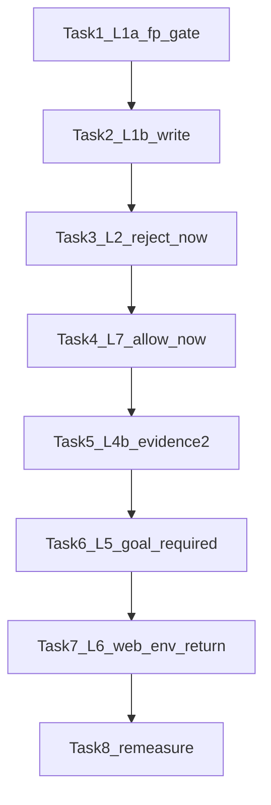

# 人格池分裂叶因修批方案 v2（策略调整）

> **For agentic workers:** REQUIRED WORKFLOW: implement task-by-task with review gates. Steps use checkbox (`- [ ]`).  
> **取代：** [`2026-09-30-uat-leaf-split-fix.md`](./2026-09-30-uat-leaf-split-fix.md)（R1/R2 审计后策略作废点已吸收）。  
> **审计入口：** [`docs/audits/plan-audit-leaf-split-fix-2026-09-30.md`](../../audits/plan-audit-leaf-split-fix-2026-09-30.md) — **Audit R3 PASS（可执行）**。用户批准后从 Task 1 开工。

**Goal:** 按分裂叶因修穿复测残留；`NF_UAT_SEED=pilot30` 达 **三计数硬闸**，且 T1–T4 全绿。

**Architecture（相对 v1 的策略调整）：**

| 点 | v1 问题 | v2 策略 |
|----|---------|---------|
| L1a 死卡 | 用 `has(确认执行)` 解锁 → 死卡当新卡 | **卡指纹**：miss 时冻结 `planCardFp`；仅 `fp≠frozen` 或新 `proposal.plan`（seq）才允许再点确认 |
| L1a after-miss | 与死卡点击竞态 | miss 后 **立即** after-miss（不等 idle=3）；期间 **零** 确认点击 |
| L6 web_env | 注释级早退 | **`driveScenario` 内直接 `return { terminal:'web_env', … }`**，永不进 autopilot |
| L2/L7 | （R1 已改） | 保持：**回调当场** silent，不靠纯文本窗 |
| L5 | （R1 已改） | 保持：harness early goal **Required** |

**Tech Stack:** Electron/React · `agentLoop.ts` · `ConversationPanel.tsx` · `uat-lib.mjs` · `uat-G-persona.mjs` · Vitest · Mac dist · ADR-012

**权威证据：** [`uat-persona-pool-leaf-rca-2026-09-30.md`](../../audits/uat-persona-pool-leaf-rca-2026-09-30.md) · 复测 leaf-remeasure

## Global Constraints

- ADR-012：Tasks 1–7 处置；Task 8 只记；未达标停等裁决
- 不改 ADR-011；不拆 unverifiable；**不恢复** `tool_choice:required`
- nudge：`silent: true`；每会话有限次；禁止加大 `maxRounds` 熬绿
- 不得缩池 / 去掉 `rejectPlan` / 取消 `refuse_once` / 去掉 `ask_what`
- **三计数硬闸：**
  - `pass` = `resolved`
  - `收口失败` = `stuck_after_plan|stuck_no_plan|timeout`
  - `环境失败` = `config|web_env`
  - **硬闸** = `pass≥10/12` ∧ `收口失败=0` ∧ `环境失败≤2` ∧ T1–T4 全绿
  - `web_env`/`config` **≠** PASS
- 禁止旧叙事：p091=L3 交付后不 report；T3=确认后再 propose_plan
- 实施时不要编辑本 plan（用户明示审计回写除外）



## 叶因 → 任务

| 叶因 | 命中 | Task | 修向 |
|------|------|------|------|
| L1a | p068 | 1 | 指纹门闩 + 立即 after-miss |
| L1b | p002 | 2 | 领域 confirm 后 produced=0 催 write |
| L2 | p087 | 3 | 拒授权回调当场 silent + harness 兜底 |
| L7 | p106 | 4 | 允许回调当场 silent |
| L4b | T3 | 5 | harness evidence×2 |
| L5 | p091 | 6 | harness early propose_goal Required |
| L6 | p042 | 7 | ensure wait+兜底；失败 `return web_env` |
| — | 关单 | 8 | dist + 复测只记 |

## File Structure

| 文件 | 职责 |
|------|------|
| `apps/desktop/scripts-cdp/uat-lib.mjs` | L1a 指纹；L4b/L5 harness；L6 ensureWeb |
| `apps/desktop/scripts-cdp/uat-G-persona.mjs` | L6 `driveScenario` 早 `return web_env` |
| `apps/desktop/src/domain/agentLoop.ts` | L1b/L2 辅/L7 辅/L5 辅 |
| `apps/desktop/src/renderer/ConversationPanel.tsx` | 拒/允当场 silent；L1b 接线 |
| `apps/desktop/tests/unit/agentLoop.test.ts` | L1 单测 |
| `docs/audits/uat-persona-pool-split-remeasure-*.md` | Task 8 |

---

### Task 1 — L1a：卡指纹门闩 + 立即 after-miss（harness）

**Files:** `apps/desktop/scripts-cdp/uat-lib.mjs`（`autopilot`）

**策略（钉死）：**

1. `planCardFp(labels)` = 排序后 `['确认执行','修改方案'].filter(has).join('|')`（无确认相关则 `''`）。
2. 点击「确认执行」前：若 `deadConfirmLock` 为真 → **跳过点击**。
3. 点击后 800ms：`planConfirmed = domainPlanConfirmedSince(startSeq)`。
4. 若 `!planConfirmed`：  
   - `frozenPlanCardFp = planCardFp(labels)`（点之前或点后快照，选定：**点击前**指纹）  
   - `deadConfirmLock = true`  
   - **同轮或下一轮优先**发 `__nudge_repropose_after_miss__`（不依赖 `__nudge_repropose__`；**不要求 idle=3**；**不要求卡消失**）。
5. 解锁 `deadConfirmLock` **仅当**：  
   - `planConfirmed`，或  
   - `planCardFp(labels) !== '' && planCardFp(labels) !== frozenPlanCardFp`，或  
   - timeline 自 miss 后新出现 `type==='proposal.plan'`（`seq > missSeq`）。  
   **禁止** `has('确认执行')` 单独解锁。

- [ ] **Step 1: Helper**

```js
function planCardFp(labels) {
  return ['确认执行', '修改方案'].filter((t) => labels.includes(t)).sort().join('|')
}

function domainNewPlanSince(sinceSeq) {
  return readLatestTimeline().some((e) => e.seq > sinceSeq && e.type === 'proposal.plan')
}
```

- [ ] **Step 2: 状态**

```js
let planConfirmed = false
let deadConfirmLock = false
let frozenPlanCardFp = ''
let missSeq = 0
```

每轮开头：

```js
if (!planConfirmed) planConfirmed = domainPlanConfirmedSince(startSeq)
if (deadConfirmLock && !planConfirmed) {
  const fp = planCardFp(labels)
  if (
    (fp && fp !== frozenPlanCardFp) ||
    (missSeq && domainNewPlanSince(missSeq))
  ) {
    deadConfirmLock = false
    frozenPlanCardFp = ''
    console.log(`  r${r}: deadConfirmLock cleared (new plan card/fp)`)
  }
}
```

- [ ] **Step 3: 点击门闩 + miss 处理**

所有「确认执行」点击路径（goal 后优先块、personaAct plan、getByRole）：

```js
if (deadConfirmLock) {
  // skip confirm click
} else if (/* would click 确认执行 */) {
  const fpBefore = planCardFp(labels)
  // ... click ...
  await page.waitForTimeout(800)
  planConfirmed = domainPlanConfirmedSince(startSeq)
  if (!planConfirmed) {
    deadConfirmLock = true
    frozenPlanCardFp = fpBefore || planCardFp(labels)
    missSeq = timelineWatermark()
    console.log(`  r${r}: confirm miss → lock fp=${frozenPlanCardFp}`)
    if (!sentTexts.has('__nudge_repropose_after_miss__')) {
      await typeAndSend(
        page,
        '系统提示：刚才的「确认执行」未生效（方案可能已失效）。请立即调用 propose_plan 重新提交可确认的最终方案；不要 ask_user。',
      )
      sentTexts.add('__nudge_repropose_after_miss__')
      actions.push(`r${r}:nudge-repropose-after-miss`)
    }
  }
}
```

- [ ] **Step 4: Commit** `fix(uat): fingerprint-gate dead plan confirm and immediate after-miss`

**Done when:** miss 后同轮有 after-miss；锁定期零确认点击；仅新 fp / 新 proposal.plan / 已确认 解锁。

---

### Task 2 — L1b：确认后 produced=0 催 write（产品）

**前提：** 仅领域 `planConfirmed===true` 时生效（靠 Task 1 推到该态）。

**Files:** `agentLoop.ts` · `ConversationPanel.tsx` · `agentLoop.test.ts`

- [ ] **Step 1: Tests**

```ts
it('确认 + produced=0 + 纯文本 → 催 write', () => { /* ... expect message 含 write */ })
it('produced>0 → false', () => { /* ... */ })
it('nudgeCount>=2 → false', () => { /* ... */ })
```

- [ ] **Step 2: Implement**

```ts
export function shouldNudgeWriteAfterPlanConfirm(input: {
  planConfirmed: boolean
  pending: string
  alreadyNudged?: boolean
  nudgeCount?: number
  maxNudges?: number
  toolNamesThisTurn: string[]
  assistantContent: string
  reproposedPlanThisTurn?: boolean
  producedCount?: number
}): { nudge: false } | { nudge: true; message: string } {
  const maxNudges = input.maxNudges ?? 2
  const nudgeCount = input.nudgeCount ?? (input.alreadyNudged ? 1 : 0)
  const producedCount = input.producedCount ?? 0
  if (
    !input.planConfirmed ||
    input.pending !== 'none' ||
    nudgeCount >= maxNudges ||
    producedCount > 0 ||
    input.toolNamesThisTurn.some((n) => n === 'write' || n === 'edit')
  )
    return { nudge: false }
  const t = String(input.assistantContent ?? '')
  const asksClickConfirm =
    /点[^。\n]{0,24}确认执行|确认执行[^。\n]{0,12}按钮|文字回复[^。\n]{0,20}不算|只有[^。\n]{0,16}按钮[^。\n]{0,16}授权|就等你[^。\n]{0,12}点/.test(
      t,
    )
  const reproposed = !!input.reproposedPlanThisTurn
  const idleNoWrite = input.toolNamesThisTurn.length === 0
  if (!asksClickConfirm && !reproposed && !idleNoWrite) return { nudge: false }
  if (
    input.toolNamesThisTurn.length > 0 &&
    !reproposed &&
    !input.toolNamesThisTurn.every((n) => n === 'propose_plan')
  )
    return { nudge: false }
  return {
    nudge: true,
    message:
      '【系统提示·非用户发言】执行方案已确认且尚未写入规划文件。请立即调用 write/edit；不要再 propose_plan、催点卡或纯文字分析。',
  }
}
```

接线：`producedCount` + nudgeCount ref。

- [ ] **Step 3: Commit** `fix(uat): nudge write on post-confirm idle with zero produces`

**Done when:** 确认后空转≤2 次催写；有产出本函数不催。

---

### Task 3 — L2：拒授权回调当场 silent

**Files:** `ConversationPanel.tsx`（主）· `agentLoop.ts`（辅二次）· `uat-lib.mjs`（Required 兜底）· tests

- [ ] **Step 1: 回调当场**

在 `rejectApproval` 包装内：

```ts
approvalWasRejectedRef.current = true
if (stateRef.current.planConfirmed && !approvalRejectImmediateNudgedRef.current) {
  approvalRejectImmediateNudgedRef.current = true
  const msg =
    '【系统提示·非用户发言】上一工具授权已被拒绝。请改用无需高风险授权的只读核验，或再次请求授权后继续；有产出则立即调用 report_completion——不要停在文字说明。'
  tlog('conversation.system_nudge', { kind: 'protocol', content: msg.slice(0, 200) }, 'system')
  void sendRef.current?.({ silent: true, text: msg })
}
rejectApproval(request, reason)
```

- [ ] **Step 2: 纯文本二次** — `shouldNudgeAfterApprovalReject` 支持 `nudgeCount`/`maxNudges=2`；immediate 已发则纯文本从 1 起算。

- [ ] **Step 3: Harness Required 兜底**

```js
if (acted && /button:(拒绝|不允许)/.test(acted)) persona.__needApprovalRejectNudge = true
// idle≥2:
if (
  !acted &&
  persona.__needApprovalRejectNudge &&
  idleRounds >= 2 &&
  !sentTexts.has('__nudge_approval_reject__')
) {
  await typeAndSend(
    page,
    '系统提示：授权已被拒绝。请改用只读核验或再次请求授权，有产出则 report_completion。',
  )
  sentTexts.add('__nudge_approval_reject__')
  persona.__needApprovalRejectNudge = false
  actions.push(`r${r}:nudge-approval-reject`)
}
```

- [ ] **Step 4: Commit** `fix(uat): immediate silent nudge on approval reject`

**Done when:** 拒授权当轮必有产品 silent；harness 兜底存在。

---

### Task 4 — L7：允许执行回调当场催 write

**Files:** `ConversationPanel.tsx` · `agentLoop.ts` · tests

- [ ] **Step 1: 在允许/批准成功包装内当场**

```ts
if (
  stateRef.current.planConfirmed &&
  stateRef.current.producedFiles.size === 0 &&
  !approvalAllowImmediateNudgedRef.current
) {
  approvalAllowImmediateNudgedRef.current = true
  const msg =
    '【系统提示·非用户发言】用户已允许执行且方案已确认。请立即 write/edit 写入规划文件；完成后调用 report_completion——不要停在文字说明。'
  tlog('conversation.system_nudge', { kind: 'protocol', content: msg.slice(0, 200) }, 'system')
  void sendRef.current?.({ silent: true, text: msg })
}
```

挂点：与 Task 3 reject 对称，包装 `useToolApproval` 的 allow 成功回调（`允许执行` / `允许并记住` / `批准这批文件` 成功路径）。

- [ ] **Step 2: 辅函数** `shouldNudgeAfterApprovalAllow`（immediate 已发则 `alreadyNudged` 防双发）+ 单测三段。

- [ ] **Step 3: Commit** `fix(uat): immediate write nudge after approval allow`

**Done when:** 允许且无产出时当轮必 silent 催写。

---

### Task 5 — L4b：证据门 harness×2

**Files:** `uat-lib.mjs`（基线含 Task 1）

- [ ] **Step 1:**

```js
if (idleRounds === 3) {
  const ui = await dump(page)
  if (ui.includes('完成声明已提交') && !ui.includes('已解决，谢谢')) {
    if (!sentTexts.has('__nudge_evidence__')) {
      await typeAndSend(
        page,
        '系统提示：verification 证据只能是只读 shell 命令（如 ls、curl），不能写 read/open/write 等工具调用。请把实际执行过的只读命令作为 verification 重新提交完成声明。',
      )
      sentTexts.add('__nudge_evidence__')
      actions.push(`r${r}:nudge-evidence`)
    } else if (!sentTexts.has('__nudge_evidence_2__')) {
      await typeAndSend(
        page,
        '系统提示：完成声明仍未通过证据门。请立刻用只读 shell（ls/curl）的真实 command+stdout 再次 report_completion；不要 web_search 代替核验。',
      )
      sentTexts.add('__nudge_evidence_2__')
      actions.push(`r${r}:nudge-evidence-2`)
    }
  } else if (/* ... after-miss 已在 Task1 立即路径；此处保留其它 idle nudge ... */) {
  }
}
```

产品 evidence×2 仅核对，无缺口不改。

- [ ] **Step 2: Commit** `fix(uat): second harness evidence nudge for completion gate`

**Done when:** 「完成声明已提交」且未解决时可催两次。

---

### Task 6 — L5：early propose_goal Required（harness）+ 产品辅

**Files:** `uat-lib.mjs` · `agentLoop.ts` · Panel · tests

- [ ] **Step 1: Harness Required**（idle nudge 优先级：evidence → approval-reject → after-miss 已即时 → repropose → propose-plan → **propose-goal-early**）

```js
} else if (
  !sentTexts.has('__goal_done__') &&
  !has('确认目标') &&
  !has('确认执行') &&
  !has('修改方案') &&
  (idleRounds >= 3 || clarifyAnswerCount >= clarifyCap) &&
  !sentTexts.has('__nudge_propose_goal_early__')
) {
  await typeAndSend(
    page,
    '系统提示：请调用 propose_goal 提交目标，否则不会出现「确认目标」卡。不要只用文字追问。',
  )
  sentTexts.add('__nudge_propose_goal_early__')
  actions.push(`r${r}:nudge-propose-goal-early`)
}
```

- [ ] **Step 2: 产品辅** `shouldNudgeProposeGoalAfterClarifyIdle`（`pending==='none'` 时才咬；pending=ask_user 时靠 harness）。

- [ ] **Step 3: Commit** `fix(uat): required early propose_goal nudge before goal card`

**Done when:** 无目标卡且（idle≥3 或 clarify 达 cap）必有 harness 催。

---

### Task 7 — L6：ensureWeb + `driveScenario` 内 `return web_env`

**Files:** `uat-lib.mjs` · `uat-G-persona.mjs`

- [ ] **Step 1: ensureWebAccessEnabled** — `waitFor('设置', 15s)` + `getByRole(设置|Settings)` + aria-label 兜底；其余 toggle/trial/key 逻辑不变。

- [ ] **Step 2: 早退（可执行形，钉死）**

重写 `uat-G-persona.mjs` 中 wantsWeb 段与 `driveScenario` 调用（ensure **移入** callback，避免侧效在外）：

```js
const wantsWeb = Boolean(apPersona?.webAsk || PERSONAS[personaKey]?.webAsk)

const result = await driveScenario(TAG, async () => {
  const startSeq = timelineWatermark()
  if (wantsWeb) {
    const webOk = await ensureWebAccessEnabled(page)
    if (!webOk) {
      console.log('web_env: ensureWebAccess failed — skip autopilot')
      return {
        terminal: 'web_env',
        actions: ['ensureWebAccess:fail'],
        events: readLatestTimeline().filter((e) => e.seq > startSeq),
        startSeq,
      }
    }
  }
  // … 从零开始 / 发任务若尚未做：保持现有启动顺序；
  // 若启动 UI 必须在 ensure 之前，则 ensure 仍放 connect 后、driveScenario 前，
  // 但失败时 driveScenario 回调开头第一件事 return web_env，且绝不调用 autopilot：
  const ap = await autopilot(page, persona, { maxRounds, pollMs, shotDir: OUT, boundary: … })
  await snap(page, `uat/${TAG}/99-final`)
  return ap
})
```

**选定启动顺序（防设置钮未挂载）：**

1. connect + command code  
2. 若有「从零开始」→ 进工作区（现有逻辑）  
3. `waitFor` 发送钮 / workspace ready  
4. **然后** `driveScenario`：若 `wantsWeb` → ensure；失败 `return web_env`；成功再 autopilot  

即：把现有「从零开始」块保持在 `driveScenario` **之前**（与今相同），仅把 ensure 从「忽略返回值」改为：

```js
let webBlocked = false
if (wantsWeb) {
  webBlocked = !(await ensureWebAccessEnabled(page))
}
const result = await driveScenario(TAG, async () => {
  if (webBlocked) {
    const startSeq = timelineWatermark()
    return {
      terminal: 'web_env',
      actions: ['ensureWebAccess:fail'],
      events: readLatestTimeline().filter((e) => e.seq > startSeq),
      startSeq,
    }
  }
  const ap = await autopilot(/* ... */)
  await snap(page, `uat/${TAG}/99-final`)
  return ap
})
```

断言：

```js
assertions.webAccess = wantsWeb ? !webBlocked : true
assertions.terminalResolved = result.terminal === 'resolved' // web_env → false
```

pool 结果行须打印 `terminal=web_env`（现有 JSON 已含 `terminal` 字段即可）。

- [ ] **Step 3: Commit** `fix(uat): return web_env from driveScenario when ensureWeb fails`

**Done when:** `webAsk`/`needs_web` 且 ensure 失败 → `terminal=web_env`、**零** autopilot 轮次；非 PASS。

---

### Task 8 — Dist + 复测只记（ADR-012）

1. rsync `src/` + `scripts-cdp/` → Mac `/tmp/nf-uat-main3r`  
2. `npm run dist`；记 asar mtime；抽检产品字面量（拒授权 / 允许执行催写 / 确认后未写入 / 澄清 propose_goal）  
3. `NF_UAT_SEED=pilot30` 池 → 只记  
4. `run-uat-tiers.sh` → 只记（nvm PATH）  
5. 审计按三计数；标 L6 是否 `web_env`  
6. 硬闸判定；未达标停  

**Done when:** 审计落盘；达标或「未达标+等裁决」。

---

## Self-Review

1. R2 B1：解锁仅指纹/新 proposal.plan/已确认 — **已钉**。  
2. R2 B2：`return { terminal:'web_env', actions, events, startSeq }` — **已钉**。  
3. R1 B1–5：当场 silent、L5 Required、三计数 — **保留**。  
4. 无旧 L3/L4 误修；不缩池；不恢复 tool_choice:required。
