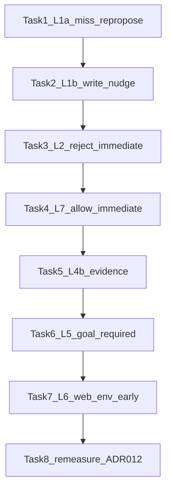

# 人格池分裂叶因修批方案（L1a/L1b/L2/L5/L6/L7/L4b）

> **已由 v2 取代：** 请改用 [`2026-09-30-uat-leaf-split-fix-v2.md`](./2026-09-30-uat-leaf-split-fix-v2.md)。  
> 本文件保留作 R1/R2 审计对照，**不要按本文执行**。

> **For agentic workers:** REQUIRED WORKFLOW: implement this plan task-by-task — either dispatch a fresh subagent per task with a review gate between tasks (recommended), or execute inline with checkpoints. Steps use checkbox (`- [ ]`) syntax for tracking.  
> **Audit：** R1 FAIL 已回写 B1–5；**R2 FAIL**（死卡解锁指纹 / web_env 早退可执行形）——见 [`docs/audits/plan-audit-leaf-split-fix-2026-09-30.md`](../../audits/plan-audit-leaf-split-fix-2026-09-30.md)。**待 R3 PASS 后方可执行。**

**Goal:** 按分裂后叶因表修穿复测残留，使 `NF_UAT_SEED=pilot30` 达关单硬闸，且 `run-uat-tiers.sh` T1–T4 全绿。

**Architecture:** 上一修批已部分打穿 L1（p114/p055 新绿）；本批针对 **形态分裂后的真实尸体**：L1a=miss 后无二次收敛且禁点死卡（harness）、L1b=确认后不写（产品扩 write nudge）、L2/L7=拒/允**回调当场** silent（不靠纯文本窗）、L4b=证据门二次催、L5=开局澄清（**harness Required** + 产品辅）、L6=web 设置门早退 `web_env`。整批修完 **一次** 复测（ADR-012）。

**Tech Stack:** Electron/React · `agentLoop.ts` · `ConversationPanel.tsx` · `scripts-cdp/uat-lib.mjs` · `uat-G-persona.mjs` · Vitest · Mac dist · ADR-012

**权威证据：** [`docs/audits/uat-persona-pool-leaf-rca-2026-09-30.md`](../../audits/uat-persona-pool-leaf-rca-2026-09-30.md) · 复测 [`…-leaf-remeasure-2026-09-30.md`](../../audits/uat-persona-pool-leaf-remeasure-2026-09-30.md)

## Global Constraints

- ADR-012：Tasks 1–7 处置轮；Task 8 复测只记；未达标 → 汇总等裁决，禁止测中连修
- 不改 ADR-011；不拆 unverifiable；**不恢复** `tool_choice:required`
- nudge：`silent: true`；每会话有限次；禁止加大 `maxRounds` 熬绿
- 不得缩池 / 去掉 `rejectPlan` / 取消 `refuse_once` / 去掉 `ask_what` 装绿
- **关单三计数（硬闸公式）：**
  - `pass` = `terminal=resolved`
  - `收口失败` = `terminal ∈ {stuck_after_plan, stuck_no_plan, timeout}`
  - `环境失败` = `terminal ∈ {config, web_env}`
  - **硬闸** = `pass≥10/12` ∧ `收口失败=0` ∧ `环境失败≤2` ∧ T1–T4 全绿  
  - `web_env` / `config` **不是** PASS；不得用例外冒充 resolved
- Task 8 前必跑 `run-uat-tiers.sh`；D-network / L3 / npm e2e **不在**关单
- **禁止**按旧「p091=L3 交付后不 report」「T3=确认后再 propose_plan」叙事改码
- 实施时 **不要编辑本 plan 文件**（审计回写除外，由用户明示）



## 叶因 → 任务映射

| 叶因 | 命中 | Task | 修向 |
|------|------|------|------|
| **L1a** P0 | p068 | Task 1 | miss 后独立 after-miss repropose；**禁连点死确认卡** |
| **L1b** P0 | p002 | Task 2 | 领域 confirm 已真前提下，`produced=0` 空转催 write |
| **L2** P0 | p087 | Task 3 | 拒授权 **回调当场** silent（+ 可选二次纯文本）；勿只加次数 |
| **L7** P0 | p106 | Task 4 | 允许执行 **回调当场** silent 催 write |
| **L4b** P1 | T3 | Task 5 | harness 证据催二次（主）；产品核对为辅 |
| **L5** P1 | p091 | Task 6 | harness early propose_goal **Required**；产品辅 |
| **L6** P2 | p042 | Task 7 | wait+兜底设置；失败 **立即** `web_env` 跳过 autopilot |
| — | 关单 | Task 8 | dist + pilot30/tiers 只记 |

## File Structure

| 文件 | 职责 |
|------|------|
| `apps/desktop/scripts-cdp/uat-lib.mjs` | L1a miss/死卡；L4b evidence×2；L5 early goal；L6 ensureWeb |
| `apps/desktop/scripts-cdp/uat-G-persona.mjs` | L6 ensure 失败早退 `web_env` |
| `apps/desktop/src/domain/agentLoop.ts` | L1b/L2/L7/L5 纯函数 |
| `apps/desktop/src/renderer/ConversationPanel.tsx` | 接线；拒/允回调当场 silent |
| `apps/desktop/tests/unit/agentLoop.test.ts` | L1 单测 |
| `docs/audits/uat-persona-pool-split-remeasure-*.md` | Task 8 只记 |

---

### Task 1 — L1a：miss confirm 后二次收敛 + 禁点死卡（harness）

**Files:**
- Modify: `apps/desktop/scripts-cdp/uat-lib.mjs`（`autopilot`）

**Interfaces:**
- Consumes: `domainPlanConfirmedSince(startSeq)`
- Produces: `missedConfirmExec`；`confirmMissCount`；`__nudge_repropose_after_miss__`；**confirm 点击门闩**

**Why：** PASS 也首次 miss；p068 死在 miss 后无二次 repropose。若 miss 后卡仍在却继续点「确认执行」，after-miss 永不到达（Blocking 4）。

- [ ] **Step 1: 状态与 miss 记录**

```js
let planConfirmed = false
let missedConfirmExec = false
let confirmMissCount = 0
// 可选：上次见到的确认卡指纹（按钮组合），用于识别「新卡」
let lastPlanCardFp = ''
```

点击「确认执行」并 `await page.waitForTimeout(800)` 后：

```js
planConfirmed = domainPlanConfirmedSince(startSeq)
if (!planConfirmed) {
  missedConfirmExec = true
  confirmMissCount += 1
  console.log(`  r${r}: click-confirm-exec but no task.execution_confirmed yet miss#${confirmMissCount}`)
}
```

- [ ] **Step 2: 禁连点死卡（选定策略）**

凡将要点「确认执行」之前：

```js
const blockDeadConfirm =
  missedConfirmExec && !planConfirmed && confirmMissCount >= 1
// blockDeadConfirm 期间：跳过所有「确认执行」点击（含 getByRole 兜底与 personaAct plan）
// 直到 after-miss 已发送且随后出现新方案卡，或 domainPlanConfirmedSince 变真
```

解除 block 条件（满足其一即可）：

1. `planConfirmed === true`，或  
2. `sentTexts.has('__nudge_repropose_after_miss__')` 且本轮重新出现「确认执行」/「修改方案」（视为新卡；可用 `labels` 指纹变化辅助）

```js
// 新卡探测：出现确认执行且 after-miss 已发 → 清 missedConfirmExec，允许再点一次
if (
  sentTexts.has('__nudge_repropose_after_miss__') &&
  has('确认执行') &&
  !planConfirmed
) {
  missedConfirmExec = false // 允许对【新】卡再点；若再 miss，confirmMissCount 继续加，再次 block
}
```

- [ ] **Step 3: after-miss 独立 nudge（不依赖 `__nudge_repropose__`）**

在 `idleRounds === 3`（或 `blockDeadConfirm && idleRounds >= 2` 以加快）分支：

```js
} else if (
  missedConfirmExec &&
  !planConfirmed &&
  !sentTexts.has('__nudge_repropose_after_miss__')
) {
  // 注意：即使 has('确认执行') 也要发——死卡存在时更需 repropose，不能等卡消失
  await typeAndSend(
    page,
    '系统提示：刚才的「确认执行」未生效（方案可能已失效）。请立即调用 propose_plan 重新提交可确认的最终方案；不要 ask_user。',
  )
  sentTexts.add('__nudge_repropose_after_miss__')
  actions.push(`r${r}:nudge-repropose-after-miss`)
  console.log(`  r${r}: nudge-repropose-after-miss sent`)
}
```

- [ ] **Step 4: Commit**

```bash
git add apps/desktop/scripts-cdp/uat-lib.mjs
git commit -m "$(cat <<'EOF'
fix(uat): block dead confirm clicks and repropose after miss

EOF
)"
```

**Done when:** miss 后必有 after-miss 路径；miss 后不会连点同一确认直到新卡或已确认。

---

### Task 2 — L1b：确认后无产出催 write（产品）

**Files:**
- Modify: `apps/desktop/src/domain/agentLoop.ts`
- Modify: `apps/desktop/src/renderer/ConversationPanel.tsx`
- Test: `apps/desktop/tests/unit/agentLoop.test.ts`

**前提（写进 Why）：** 本任务只在 **领域** `planConfirmed===true`（`task.execution_confirmed` 已发生）时生效。L1a（Task 1）负责把会话推到该态；若仍无领域 confirm，本 nudge **正确不触发**。

**Interfaces:**
- Produces: `shouldNudgeWriteAfterPlanConfirm` 扩 `producedCount` / `nudgeCount` / `maxNudges`  
- **`producedCount > 0` → 直接 `{ nudge: false }`**（交给 deliverables/evidence；不保留催点卡旁路）

- [ ] **Step 1: Failing tests**

```ts
it('方案已确认 + produced=0 + 纯文本空转 → 催 write', () => {
  const r = shouldNudgeWriteAfterPlanConfirm({
    planConfirmed: true,
    pending: 'none',
    alreadyNudged: false,
    toolNamesThisTurn: [],
    assistantContent: '我再想想文件结构。',
    producedCount: 0,
  })
  expect(r.nudge).toBe(true)
  if (r.nudge) expect(r.message).toContain('write')
})
it('已有产出 → 不催（本函数直接 false）', () => {
  expect(
    shouldNudgeWriteAfterPlanConfirm({
      planConfirmed: true,
      pending: 'none',
      alreadyNudged: false,
      toolNamesThisTurn: [],
      assistantContent: '确认执行按钮…',
      producedCount: 1,
    }).nudge,
  ).toBe(false)
})
it('nudgeCount 达 maxNudges → 不催', () => {
  expect(
    shouldNudgeWriteAfterPlanConfirm({
      planConfirmed: true,
      pending: 'none',
      nudgeCount: 2,
      toolNamesThisTurn: [],
      assistantContent: '…',
      producedCount: 0,
    }).nudge,
  ).toBe(false)
})
```

保留 asksClickConfirm / reproposed（在 `producedCount===0` 下）用例。

- [ ] **Step 2–3: Implement**

```ts
export function shouldNudgeWriteAfterPlanConfirm(input: {
  planConfirmed: boolean
  pending: string
  alreadyNudged?: boolean
  nudgeCount?: number
  maxNudges?: number
  toolNamesThisTurn: string[]
  assistantContent: string
  reproposedPlanThisTurn?: boolean
  producedCount?: number
}): { nudge: false } | { nudge: true; message: string } {
  const maxNudges = input.maxNudges ?? 2
  const nudgeCount = input.nudgeCount ?? (input.alreadyNudged ? 1 : 0)
  const producedCount = input.producedCount ?? 0
  if (
    !input.planConfirmed ||
    input.pending !== 'none' ||
    nudgeCount >= maxNudges ||
    producedCount > 0 ||
    input.toolNamesThisTurn.some((n) => n === 'write' || n === 'edit')
  )
    return { nudge: false }
  const t = String(input.assistantContent ?? '')
  const asksClickConfirm =
    /点[^。\n]{0,24}确认执行|确认执行[^。\n]{0,12}按钮|文字回复[^。\n]{0,20}不算|只有[^。\n]{0,16}按钮[^。\n]{0,16}授权|就等你[^。\n]{0,12}点/.test(
      t,
    )
  const reproposed = !!input.reproposedPlanThisTurn
  const idleNoWrite = input.toolNamesThisTurn.length === 0
  if (!asksClickConfirm && !reproposed && !idleNoWrite) return { nudge: false }
  if (
    input.toolNamesThisTurn.length > 0 &&
    !reproposed &&
    !input.toolNamesThisTurn.every((n) => n === 'propose_plan')
  )
    return { nudge: false }
  return {
    nudge: true,
    message:
      '【系统提示·非用户发言】执行方案已确认且尚未写入规划文件。请立即调用 write/edit；不要再 propose_plan、催点卡或纯文字分析。',
  }
}
```

接线：`producedCount: stateRef.current.producedFiles.size`；nudgeCount ref。

- [ ] **Step 4: PASS + Commit** `fix(uat): nudge write on post-confirm idle with zero produces`

**Done when:** 领域确认后空转可催 write≤2；有产出本函数不催。

---

### Task 3 — L2：拒授权回调当场 silent（产品；harness 兜底）

**Files:**
- Modify: `agentLoop.ts`（保留/扩展 `shouldNudgeAfterApprovalReject` 供纯文本二次）
- Modify: `ConversationPanel.tsx`（**主路径：reject 回调当场 send**）
- Optional Modify: `uat-lib.mjs`（拒绝后 idle≤2 harness 催，防产品未咬）
- Test: `agentLoop.test.ts`

**Why：** 仅扩 `maxNudges` 与已失败单次 silent **同构**（Blocking 1）。p087 在拒后模型无纯文本收尾 → stuckIdle 先杀。

- [ ] **Step 1: 回调当场（主）**

在 `rejectApproval` 包装内（已置 `approvalWasRejectedRef=true` 处）**立即**：

```ts
if (stateRef.current.planConfirmed && !approvalRejectImmediateNudgedRef.current) {
  approvalRejectImmediateNudgedRef.current = true
  const msg =
    '【系统提示·非用户发言】上一工具授权已被拒绝。请改用无需高风险授权的只读核验，或再次请求授权后继续；有产出则立即调用 report_completion——不要停在文字说明。'
  tlog('conversation.system_nudge', { kind: 'protocol', content: msg.slice(0, 200) }, 'system')
  void sendRef.current?.({ silent: true, text: msg })
}
```

不依赖 `toolCalls.length===0` / 下一轮 done。

- [ ] **Step 2: 纯文本二次（辅）**

保留 `shouldNudgeAfterApprovalReject`：`nudgeCount`/`maxNudges=2`；**首次若已 immediate，则 pure-text 路径从 nudgeCount=1 起算二次**（或 `alreadyImmediate` 跳过首次文案）。单测覆盖：二次纯文本仍可催；`nudgeCount>=2` 停。

- [ ] **Step 3: Harness 兜底（Required 轻量）**

`autopilot` 中若 `acted` 匹配 `/button:拒绝|不允许/`：

```js
persona.__approvalRefused = true // 若尚未
// 标记待催
persona.__needApprovalRejectNudge = true
```

随后 `!acted && persona.__needApprovalRejectNudge && idleRounds>=2 && !sentTexts.has('__nudge_approval_reject__')`：

```js
await typeAndSend(
  page,
  '系统提示：授权已被拒绝。请改用只读核验或再次请求授权，有产出则 report_completion。',
)
sentTexts.add('__nudge_approval_reject__')
persona.__needApprovalRejectNudge = false
```

- [ ] **Step 4: Commit** `fix(uat): immediate silent nudge on approval reject`

**Done when:** 拒授权当轮必有一次 silent（产品回调）；另有纯文本二次与 harness 兜底。

---

### Task 4 — L7：允许执行回调当场催 write（产品）

**Files:**
- Modify: `agentLoop.ts` — `shouldNudgeAfterApprovalAllow`（辅：纯文本补一刀）
- Modify: `ConversationPanel.tsx` — **允许成功回调当场 silent**
- Test: `agentLoop.test.ts`

**Why：** p106 允许后空转；纯文本窗不可靠（Blocking 1 同构）。

- [ ] **Step 1: 回调当场（主）**

在允许/批准成功路径（`__approvedOnce` 对称的产品回调：`approve` / `允许执行` 成功）：

```ts
if (
  stateRef.current.planConfirmed &&
  stateRef.current.producedFiles.size === 0 &&
  !approvalAllowImmediateNudgedRef.current
) {
  approvalAllowImmediateNudgedRef.current = true
  const msg =
    '【系统提示·非用户发言】用户已允许执行且方案已确认。请立即 write/edit 写入规划文件；完成后调用 report_completion——不要停在文字说明。'
  tlog('conversation.system_nudge', { kind: 'protocol', content: msg.slice(0, 200) }, 'system')
  void sendRef.current?.({ silent: true, text: msg })
}
```

- [ ] **Step 2: 纯文本函数（辅）**

```ts
export function shouldNudgeAfterApprovalAllow(input: {
  planConfirmed: boolean
  pending: string
  approvalWasAllowed: boolean
  producedCount: number
  alreadyNudged: boolean
  toolNamesThisTurn: string[]
}): { nudge: false } | { nudge: true; message: string } {
  if (
    !input.planConfirmed ||
    input.pending !== 'none' ||
    !input.approvalWasAllowed ||
    input.producedCount > 0 ||
    input.alreadyNudged ||
    input.toolNamesThisTurn.length > 0
  )
    return { nudge: false }
  return {
    nudge: true,
    message:
      '【系统提示·非用户发言】用户已允许执行且方案已确认。请立即 write/edit 写入规划文件；完成后调用 report_completion——不要停在文字说明。',
  }
}
```

单测三段（催 / 有产出不催 / 未允许不催）。若 immediate 已发，`alreadyNudged` 或独立 ref 避免双发同轮——**immediate 优先；纯文本仅当 immediate 未发且随后空转**。

- [ ] **Step 3: Commit** `fix(uat): immediate write nudge after approval allow`

**Done when:** 允许当轮（无产出时）必有 silent 催写。

---

### Task 5 — L4b：证据门二次催（harness 主）

**Files:**
- Modify: `uat-lib.mjs`（基线含 Task 1；同文件续改）
- 产品 `evidenceReportNudgeCountRef` 已存在 → **仅核对，无缺口不改**

**Why：** T3 已一次 `nudge-evidence` 仍 timeout；主修 harness 二次。

- [ ] **Step 1: Harness 二次 evidence（Done 条件）**

在 `idleRounds === 3` 的 evidence 分支：

```js
if (ui.includes('完成声明已提交') && !ui.includes('已解决，谢谢')) {
  if (!sentTexts.has('__nudge_evidence__')) {
    await typeAndSend(
      page,
      '系统提示：verification 证据只能是只读 shell 命令（如 ls、curl），不能写 read/open/write 等工具调用。请把实际执行过的只读命令作为 verification 重新提交完成声明。',
    )
    sentTexts.add('__nudge_evidence__')
    actions.push(`r${r}:nudge-evidence`)
  } else if (!sentTexts.has('__nudge_evidence_2__')) {
    await typeAndSend(
      page,
      '系统提示：完成声明仍未通过证据门。请立刻用只读 shell（ls/curl）的真实 command+stdout 再次 report_completion；不要 web_search 代替核验。',
    )
    sentTexts.add('__nudge_evidence_2__')
    actions.push(`r${r}:nudge-evidence-2`)
  }
}
```

- [ ] **Step 2: 产品** — 确认 Panel 二次 evidence 接线仍在；**无缺口则零改动**。

- [ ] **Step 3: Commit** `fix(uat): second harness evidence nudge for completion gate`

**Done when:** harness 在「完成声明已提交」且未解决时可催 **两次**。

---

### Task 6 — L5：开局催 propose_goal（harness Required + 产品辅）

**Files:**
- Modify: `uat-lib.mjs` — **Required** `__nudge_propose_goal_early__`
- Modify: `agentLoop.ts` + Panel — 辅
- Test: `agentLoop.test.ts`

**Why：** p091 `type-ask` 时 `pending=ask_user` → 产品 `pending!=='none'` 门控恒假（Blocking 2）。Harness 必须 Required。

- [ ] **Step 1: Harness Required**

```js
} else if (
  !sentTexts.has('__goal_done__') &&
  !has('确认目标') &&
  !has('确认执行') &&
  !has('修改方案') &&
  idleRounds >= 3 &&
  !sentTexts.has('__nudge_propose_goal_early__')
) {
  await typeAndSend(
    page,
    '系统提示：请调用 propose_goal 提交目标，否则不会出现「确认目标」卡。不要只用文字追问。',
  )
  sentTexts.add('__nudge_propose_goal_early__')
  actions.push(`r${r}:nudge-propose-goal-early`)
}
```

（与 evidence / after-miss 分支并列，条件互斥写清优先级：evidence → after-miss → approval-reject → repropose → propose-plan → **propose-goal-early**。）

- [ ] **Step 2: 产品辅**

```ts
export function shouldNudgeProposeGoalAfterClarifyIdle(input: {
  goalConfirmed: boolean
  pending: string
  clarifyIdleTurns: number
  alreadyNudged: boolean
  toolNamesThisTurn: string[]
}): { nudge: false } | { nudge: true; message: string } {
  if (
    input.goalConfirmed ||
    input.pending !== 'none' ||
    input.alreadyNudged ||
    input.clarifyIdleTurns < 2 ||
    input.toolNamesThisTurn.length > 0
  )
    return { nudge: false }
  return {
    nudge: true,
    message:
      '【系统提示·非用户发言】目标尚未确认且会话停在澄清。请立即调用 propose_goal 提交可确认目标；不要只用文字追问。',
  }
}
```

单测 1 条正向；接线在 `!goalConfirmed` 且 `pending==='none'` 时累加 `clarifyIdleTurnsRef`。

- [ ] **Step 3: Commit** `fix(uat): required early propose_goal nudge before goal card`

**Done when:** 无目标卡且 idle≥3 **必有** harness early goal 催；产品辅可选咬合。

---

### Task 7 — L6：ensureWeb 等待+兜底；失败立即 web_env

**Files:**
- Modify: `uat-lib.mjs` — `ensureWebAccessEnabled`
- Modify: `uat-G-persona.mjs` — **早退**

**Why：** 忽略返回值会跑满 timeout（Blocking 3）；字段名用 `capabilityNeed === 'needs_web'` / adapt 后 `webAsk`。

- [ ] **Step 1: wait + 设置入口兜底**

```js
export async function ensureWebAccessEnabled(page) {
  // 等待工作区铬条（设置在 MainWorkspace header）
  try {
    await page.getByRole('button', { name: '设置' }).waitFor({ state: 'visible', timeout: 15000 })
  } catch {
    console.log('ensureWebAccess: 设置 button not visible in 15s')
  }
  let settingsBtn = page.getByRole('button', { name: '设置' })
  if (!(await settingsBtn.count())) {
    settingsBtn = page.getByRole('button', { name: /设置|Settings/i })
  }
  if (!(await settingsBtn.count())) {
    const byAttr = page.locator('[aria-label*="设置"], [title*="设置"]')
    if (await byAttr.count()) await byAttr.first().click()
    else {
      console.log('ensureWebAccess: no 设置 button')
      return false
    }
  } else {
    await settingsBtn.first().click()
  }
  // …保持既有 toggle / trial / key / Escape 逻辑不变
}
```

- [ ] **Step 2: 早退（选定；禁止事后贴标签）**

在 `uat-G-persona.mjs`：

```js
const wantsWeb = apPersona?.webAsk || PERSONAS[personaKey]?.webAsk
let webOk = true
if (wantsWeb) {
  webOk = await ensureWebAccessEnabled(page)
  if (!webOk) {
    console.log('web_env: ensureWebAccess failed — skip autopilot')
    // 构造与 driveScenario 兼容的失败结果：terminal=web_env，assertions.webAccess=false
    // 不得再调用 autopilot
    // exit 非 0；terminalResolved=false
  }
}
if (webOk) {
  // 现有从零开始 / autopilot 路径
}
```

`terminal=web_env` 须写入结果 JSON / pool results 行（与 `timeout` 并列可解析）。**禁止** `web_env` → PASS。

- [ ] **Step 3: Commit** `fix(uat): early web_env exit when ensureWebAccess fails`

**Done when:** `needs_web`/`webAsk` 且 ensure 失败 → 立即结束为 `web_env`，不跑 autopilot；设置钮有 wait+兜底。

---

### Task 8 — Dist + 复测只记（ADR-012）

**Files:**
- Mac dist + 同步 `src/` + `scripts-cdp/`
- Create: `docs/audits/uat-persona-pool-split-remeasure-YYYY-MM-DD.md`

**顺序：**

1. rsync → Mac `/tmp/nf-uat-main3r`
2. `npm run dist`；记 asar mtime；抽检产品字面量（允许执行催写 / 拒授权当场 / 确认后未写入 / 澄清 propose_goal）
3. `NF_UAT_SEED=pilot30` 跑池 → 只记
4. `run-uat-tiers.sh` → 只记（nvm PATH）
5. 审计按 **三计数** 汇总；标 L6 是否为 `web_env`
6. 硬闸判定；未达标停等裁决

**Done when:** 审计落盘；完成态=达标或「未达标+等裁决」。

---

## Self-Review（R1 回写后）

1. **Blocking 1：** Task 3/4 主路径改为拒/允回调当场 silent；纯文本为辅。  
2. **Blocking 2：** Task 6 harness early goal **Required**。  
3. **Blocking 3：** Task 7 ensure 失败立即 `web_env` 跳过 autopilot。  
4. **Blocking 4：** Task 1 miss 后禁连点死卡；after-miss **即使卡仍在也发**。  
5. **Blocking 5：** Global Constraints 三计数 + 硬闸公式。  
6. **无**旧 L3/L4 误修；不缩池；不恢复 tool_choice:required。
