# 12 人格 UAT 叶因修复方案

> **状态：已落地验绿**（2026-09-30）· Mac `G-impatient=0` `G-contradictory=0` · asar 07:49  
> 关单摘记：`docs/audits/uat-persona-3round-2026-09-30.md`「修复关单」节

**Goal:** 修掉 [`docs/audits/uat-persona-3round-2026-09-30.md`](../../audits/uat-persona-3round-2026-09-30.md) 两例 timeout 的全部叶因；Mac 重跑 G-impatient + G-contradictory（及回归 personas）PASS。  
**RCA 权威：** 同审计文「根因分析」节。  
**硬闸：** ADR-012 测批已结束，本方案批准后开修；遵守既有 G1/G2（不放宽 `verifyCompletion` / unverifiable；不 force `tool_choice:required`）。

```mermaid
flowchart TD
  subgraph fix1 [FixA 竞态]
    GoalBtn["确认目标按钮"] --> Echo["异步 send 确认，目标清楚了"]
    Echo --> SkipC2["isDecisionCardEcho 跳过 C2"]
    SkipC2 --> NoReject["不隐式拒方案"]
  end
  subgraph fix2 [FixB 确认后无 write]
    PlanOK["planConfirmed"] --> PureText["纯文字催点确认执行"]
    PureText --> NudgeWrite["shouldNudgeWriteAfterPlanConfirm"]
    NudgeWrite --> Write["模型 write"]
  end
  subgraph fix3 [FixC 证据环]
    EvMiss["evidence_missing"] --> BashOK["只读 bash 已执行"]
    BashOK --> Nudge2["二次催 report_completion"]
    Nudge2 --> Report["再 report"]
  end
```



## 全局约束

- 不改 ADR-011 成功语义；不拆 unverifiable 硬挡；不恢复 `tool_choice:required`
- 新 nudge 一律 silent（`isSystemNudgeText`），每会话有限次，防死循环
- TDD：领域纯函数先写 L1，再接线 renderer
- 关单水位：Mac 重打 dist 后至少 `G-impatient=0` + `G-contradictory=0`；建议全量 `run-uat-persona-rounds.sh` 1–3

## 文件地图

| 文件 | 改动 |
|------|------|
| [`apps/desktop/src/domain/agentLoop.ts`](apps/desktop/src/domain/agentLoop.ts) | `isDecisionCardEcho`；`shouldNudgeWriteAfterPlanConfirm`；扩展 `shouldNudgeReportAfterEvidenceMissing` |
| [`apps/desktop/src/domain/conversationState.ts`](apps/desktop/src/domain/conversationState.ts) | `buildEvidenceBackfill` 伪命令措辞加强 |
| [`apps/desktop/src/renderer/ConversationPanel.tsx`](apps/desktop/src/renderer/ConversationPanel.tsx) | C2 跳过 echo；C2 拒 plan 置 `planWasRejectedRef`；接线两 nudge；补证后二次催计数 |
| [`apps/desktop/tests/unit/agentLoop.test.ts`](apps/desktop/tests/unit/agentLoop.test.ts) | 新/扩展用例 |
| [`apps/desktop/tests/unit/conversationState.test.ts`](apps/desktop/tests/unit/conversationState.test.ts) | backfill 文案断言 |
| 可选 L3 | 确认目标后延迟 echo 不拒方案（若现有 interaction 易加） |
| [`docs/audits/uat-persona-3round-2026-09-30.md`](docs/audits/uat-persona-3round-2026-09-30.md) | 修后关单摘记 |
| 本方案落盘 | `docs/superpowers/plans/2026-09-30-uat-persona-12-fix.md` |

---

### Task 1 — FixA：确认卡合成消息不触发 C2

**叶因：** 目标按钮 `confirm('goal')` 后 `void send('确认，目标清楚了')` 晚到 → plan pending 下非确认意图 → `reject(plan, direction)`（timeline 22:42:23.612）。`isConfirmIntent('确认，目标清楚了')` 为 false（逗号打断「确认目标」）。

**做法（选定）：** 领域函数识别按钮回声，C2 整段跳过（不 confirm 也不 reject），消息仍入聊天作回声。

```ts
// agentLoop.ts
export const DECISION_CARD_ECHO = [
  '确认，目标清楚了',
  '确认，按方案执行',
  '目标需要重新描述一下',
] as const

export function isDecisionCardEcho(t: string): boolean {
  const s = String(t ?? '').trim()
  return (DECISION_CARD_ECHO as readonly string[]).includes(s)
}
```

[`ConversationPanel.tsx`](apps/desktop/src/renderer/ConversationPanel.tsx) ~2272：

```ts
if (pendingKind !== 'none' && pendingKind !== 'approval') {
  if (isDecisionCardEcho(text)) {
    // 按钮已完成决策；回声迟到不得隐式拒/确认另一决策点
  } else if (isConfirmIntent(text)) {
    confirm(pendingKind)
  } else {
    reject(pendingKind, { kind: 'direction', text })
    if (pendingKind === 'plan') planWasRejectedRef.current = true  // FixA 附带
  }
}
```

**附带：** C2 隐式拒 plan 时置 `planWasRejectedRef=true`（现仅「修改方案」按钮置位 → 产品 `shouldNudgeProposeAfterPlanReject` 对竞态拒方案失效）。

**L1：** `isDecisionCardEcho` 正/反例；C2 拒 plan 置位可在注释+既有 nudge 单测覆盖输入 `planWasRejected: true`。

**Done when:** 单测绿；逻辑上迟到目标回声不再 `action=reject`。

---

### Task 2 — FixB：方案已确认后纯文字催点卡 → 催 write

**叶因：** `planConfirmed` + `forceTool` 仅 timeline（API 恒 auto）→ 模型再出「请点确认执行」；`isCommunicationLike` 含「确认」→ StuckDetector **重置**不 escalate。

**做法（选定）：** 新增并列 nudge（不改全局 `isCommunicationLike`，避免误伤澄清对话）：

```ts
export function shouldNudgeWriteAfterPlanConfirm(input: {
  planConfirmed: boolean
  pending: string
  alreadyNudged: boolean
  toolNamesThisTurn: string[]
  assistantContent: string
}): { nudge: false } | { nudge: true; message: string }
```

触发：`planConfirmed && pending==='none' && !alreadyNudged && toolNames.length===0` 且正文匹配催点卡话术（例：`点.*确认执行|确认执行.*按钮|文字回复.*不算|只有.*按钮.*授权`）。

文案要点：方案**已确认**，禁止再要用户点卡；立即 `write`/`edit` 规划文件。

接线：[`ConversationPanel.tsx`](apps/desktop/src/renderer/ConversationPanel.tsx) `planConfirmed` 分支里，在 `shouldNudgeReportAfterEvidenceMissing` **之前**（无 evidence 时）或与 StuckDetector 之间；`planConfirmWriteNudgedRef` 每会话 1 次。

**L1：** 命中/未确认/有工具/已 nudge / 普通分析文本不命中。

**Done when:** 单测绿；与 S5-2「马上改」escalate 路径不冲突（催点卡走专用 nudge，承诺类仍走 StuckDetector）。

---

### Task 3 — FixC：证据门后二次催 `report_completion`

**叶因：** `shouldNudgeReportAfterEvidenceMissing` 在纯文本轮已 `alreadyNudged=true`；随后 bash 补证成功，再出「请点确认卡」纯文字时 **不再催**（contradictory 23:02:37）。

**做法（选定）：** 扩展判定，允许第二次：

```ts
// 输入扩展
nudgeCount: number           // 已催次数
maxNudges?: number           // 默认 2
readonlyVerifyDoneSinceMissing: boolean  // evidence_missing 后曾成功执行只读 bash/read
```

规则：
- `nudgeCount >= maxNudges` → false
- 首次：同现逻辑（纯文本 + evidenceWasMissing）
- 第二次：`readonlyVerifyDoneSinceMissing && toolNames 不含 report_completion &&（纯文本或仅非 completion 收尾）`

renderer：
- `evidenceReportNudgeCountRef`
- `readonlyVerifyAfterEvidenceRef`：在 tool 结果 `bash`/`read` status=done 且 `evidenceGuideCountRef>0` 时置 true
- `report_completion` 成功（verify ok）后清零相关 ref

**L1：** 首次催 / 二次在 readonly 后催 / 满 2 次停 / 中间又 report 则不催。

**Done when:** 单测绿；覆盖「补证 bash 已跑通仍纯文字」路径。

---

### Task 4 — FixD：伪命令 verification 回填加强（P1）

**叶因：** verification = 自然语言伪命令 → 全进 `unverifiable` → 零可代跑 → ok=false。

**做法（选定）：** 只加强 [`buildEvidenceBackfill`](apps/desktop/src/domain/conversationState.ts)（不放宽 `isSystemVerifiable`）：

- 明确禁止：中文叙述、未真实执行的 `node -e "…"` 散文、无 stdout 的臆造命令
- 要求：先 `bash` 跑只读命令，再 `report_completion` 填 **同一** command + 真实 stdout
- 单测锁定关键字面量（与 Gate 可搜字符串一致）

**Done when：** `conversationState.test.ts` 断言新措辞；行为仍 fail-closed。

---

### Task 5 — 验证与关单

1. `cd apps/desktop && npx vitest run tests/unit/agentLoop.test.ts tests/unit/conversationState.test.ts`
2. 双 tsc + 相关 L3（若加了 interaction）
3. Mac 重打未预发包 → 单跑 `G-impatient`、`G-contradictory` → 再 `run-uat-persona-rounds.sh` 1–3
4. 审计文追加「修复关单」：叶因→提交/结果；handoff 按需

**关单硬条件：** `G-impatient=0` 且 `G-contradictory=0`；其余人格无新红线回归。

---

## 明确不修 / 不做

- 恢复 API `tool_choice:required`
- 放空 verification / 让 unverifiable 单独放行（ADR-011 已裁定）
- 为绿改 G 任务文案或关 StuckDetector
- 把 harness interrupt 落盘差异当产品 bug（非本两例叶因）
