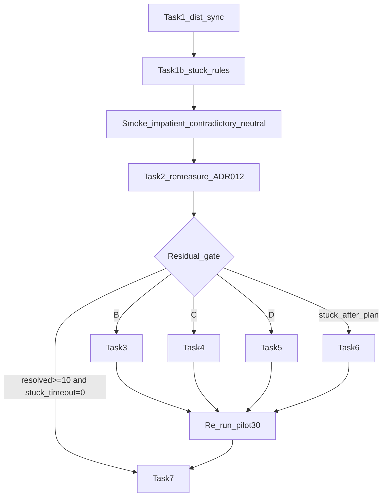

# 人格池试点收口失败修批方案

> **Audit：** R1 FAIL 已回写；全文 [`docs/audits/plan-audit-pool-timeout-fix-2026-09-30.md`](docs/audits/plan-audit-pool-timeout-fix-2026-09-30.md)。  
> **状态：Audit R3 PASS（可执行）**

**Goal:** `NF_UAT_SEED=pilot30` 抽 12：**PASS ⟺ `terminal=resolved` + 红线 + tag**。失败用 `stuck_*` / `config` / 兜底 `timeout` 分类表达（均为 FAIL）。先对齐 A–D dist，再条件修残差。

**Architecture:** 试点 asar `01:31` ≪ A–D `07:49` → 簇 A 先换包验证。顺序固定：

`dist+同步 scripts` → `Task1b 早停` → `烟测三绿` → `Task2 复测只记` → `残差条件修` → `Task7 关单`。

**Tech Stack:** Electron/React · `scripts-cdp` · Mac dist · ADR-012

## 轴覆盖（不满足「全部 e2e 分类」）

本方案 **不是** 全量 e2e 关单。对照现行分类：

| 分类 | 入口 | 本方案 | 说明 |
|------|------|--------|------|
| L1 单测 | `npx vitest run` | 仅 Task6 触及相关 L1 | 不替代全量 L1 |
| L2 类型 | 双 `tsc --noEmit` | Task6 Done 要求 | 烟测/池不替代 |
| L3 interaction | `playwright --project=interaction` | **不做** | 矩阵另表 |
| `npm run e2e` | apps/desktop e2e | **不做** | |
| **UAT 人格池** | `run-uat-persona-pool.sh` | **主目标** | pilot30 关单 |
| UAT legacy 人格 | `run-uat-persona-rounds.sh` / `run-uat-personas.sh` | 仅 Task1b 后三烟测 + 可选 | 非关单硬闸 |
| **UAT 任务轴 T1–T4** | `run-uat-tiers.sh` | **不做关单** | 与人格正交；共享 `autopilot` |
| **UAT 环境轴** | `uat-D-network.mjs` 等 | **不做** | |

**共享 harness 风险：** Task1b/3/4/5 改 `uat-lib.mjs` 的 `autopilot`，T 档与 D-network 也会吃到。  
**选定回归（写入 Task7，非扩大 Goal）：** 关单前加跑 `run-uat-tiers.sh` 一次；任一条 T*=非0 → 先修 harness 误杀，不得宣称池关单完成。D-network 仍不在本方案。

## 不依赖 timeout（判定契约）

| 规则 | 内容 |
|------|------|
| 唯一成功 | `terminal=resolved` |
| 失败分类 | `stuck_after_plan` · `stuck_no_plan` · `config` · 兜底 `timeout` |
| 早停原则 | 仅在 **无决策卡可点** 且 **连续 idle** 时咬合；禁止半程墙钟误杀拒方案人格 |
| 禁止 | 加大 `maxRounds` 熬绿；用 timeout/stuck 条充环境例外 |

## Global Constraints

- ADR-012：Task2 只记；其后 harness/产品分提交；关单前再跑同 seed
- 不改 ADR-011；不拆 unverifiable；不恢复 `tool_choice:required`
- 新 nudge：silent + 每会话有限次
- 不得缩池 / 去掉分层极端档 / 加长 maxRounds 装绿
- **关单硬闸：** 结果中 **零** `stuck_*` 与 **零** `timeout`；pass≥10/12；非收口例外最多 2 条且 **仅** `config` 或 `web_env`
- 水位：asar mtime、scripts 同步说明、结果文件路径写入审计
- Task7 前必须跑通 `run-uat-tiers.sh`（防共享 autopilot 误杀任务轴）；D-network / L3 / npm e2e **不在**本方案关单



## 证据锚点（试点 · 01:31 包）

| 簇 | 例 | 特征 | 归属 |
|----|-----|------|------|
| A | p002/p114/p055 | plan 后未已解决 | 换 A–D dist 验证 |
| B | p076/p069 | plan 前 interrupt×6 | harness 压力（条件修） |
| C | p005/p106 | 允许后伪 type-ask | harness（条件修） |
| D | p018；p042 | 钥匙 / 无设置 | 环境（条件修） |

权威：`docs/audits/uat-persona-pool-pilot30-2026-09-30.md`  
A–D：`docs/superpowers/plans/2026-09-30-uat-persona-12-fix.md`

### 残差门控（Task2 之后）

定义 **收口失败** = `terminal ∈ {timeout, stuck_after_plan, stuck_no_plan}`。

| 复测结果 | 动作 |
|----------|------|
| 收口失败=0 且 resolved≥10/12 | 跳过 Task3–6 → Task7 |
| 收口失败≥1 | 只开 **命中簇** 对应 Task3/4/5/6 |
| 收口失败≥4 或 resolved&lt;6 | 允许一次开齐 **已命中** 的 harness 簇；仍禁未命中空改 |

Task2 是 **含 Task1b 的新水位基线**（不必与试点逐条 timeout 对照），对照维度：是否仍收口失败 / 哪一 stuck 类。

---

### Task 1 — Dist + 同步 scripts

**Files:** Mac pack；`apps/desktop/scripts-cdp/**` → 跑测机

- [ ] 含 A–D 的树打 Mac dist；asar mtime **>** `2026-09-30 07:49`
- [ ] 同步 scripts-cdp（整目录或至少 uat-lib / uat-G-persona / 池文件 / runner）
- [ ] **本任务不跑烟测**（烟测在 1b 之后）

**Done when:** 新 asar 在跑测机可启动；scripts 与仓库一致

---

### Task 1b — stuck 早停（再烟测）

**Files:** `apps/desktop/scripts-cdp/uat-lib.mjs`（`autopilot`）；`docs/tests/uat-persona-pool.md` 一行失败态枚举

**决策卡集合（有任一则禁止 stuck 早停）：**  
`已解决` | `允许执行` | `允许并记住` | `批准这批文件` | `确认执行` | `确认目标` | `修改方案` | `.nf-candidates` 可见可点

**选定规则（提交，无「可选」）：**

```js
const decisionPending = /* 上表任一可见 */
// A: 方案已确认后空转
if (planConfirmed && !decisionPending && idleRounds >= 8) {
  return { terminal: 'stuck_after_plan', actions, events, startSeq }
}
// B: 从未确认方案且真·空闲（禁止用 r>=maxRounds/2）
if (!planConfirmed && !decisionPending && idleRounds >= 15) {
  return { terminal: 'stuck_no_plan', actions, events, startSeq }
}
// 循环结束兜底
return { terminal: 'timeout', ... }
```

`idleRounds` 仅在本轮 `!acted` 时递增（保持现逻辑）；有决策卡时 `personaAct` 应能 acted——若 ask_what/refuse 占一轮，idle 清零，不误杀。

- [ ] 实现上列两门 + 兜底 timeout
- [ ] 确认 `terminalResolved` 仅 `=== 'resolved'`（stuck/timeout → FAIL）
- [ ] **然后**烟测：`G-impatient`、`G-contradictory`、`G-neutral` → rc=0（验证早停不误杀快乐路径）
- [ ] 烟测任一条非 0：停池修批，先查 1b 误杀或 A–D 回归

**Done when:** 三烟测 PASS；人为无决策卡空转可在 ≪80 轮以 `stuck_*` 退出

---

### Task 2 — pilot30 复测（ADR-012 只记）

- [ ] `NF_UAT_SEED=pilot30 bash scripts-cdp/run-uat-persona-pool.sh`
- [ ] 表：id / terminal / tags / 末 5 actions / UD timeline 路径
- [ ] 按残差门控表分支；**禁止**本任务改码

**Done when:** 12 行结果 + 审计「复测（新水位）」节

---

### Task 3 —（条件·簇 B）插话仅 planConfirmed

> 定性：**降 harness 过早插话**，非产品收口修。

- [ ] 门控：Task2 仍出现 plan 前 `interrupt#`
- [ ] `interruptArmed = planConfirmed`（`uat-lib.mjs`）
- [ ] 单跑 fast：插话均在确认执行后；`interruptsAtLeast` 仍绿，否则改为 `min(2, interrupt)` 并改 `assertProfile`/文档（明示）

**Done when:** plan 前零插话；执行期急躁可测

---

### Task 4 —（条件·簇 C）授权后抑制伪 type-ask

- [ ] 门控：Task2 仍见批准后无 clarify 卡却 `type-ask`
- [ ] `__approvedOnce` 后跳过 type-ask，当且仅当无 `.nf-candidates` 且无「问题已发出」
- [ ] 仍允许 resolution / plan 后 interrupt / webAsk / boundary

**Done when:** p005 类路径无伪 type-ask；真澄清仍可答

---

### Task 5 —（条件·簇 D）钥匙 / web

- [ ] 门控：Task2 仍有 config 或 web_env
- [ ] `NF_UAT_MODEL_ID` 填上游模型 ID 后重试；网络 backoff×2；失败 terminal 记 config 语义（脚本 exit≠0）
- [ ] web：无「设置」则侧栏/直达；仍无则 `web-access-skip`；web tag 如实 FAIL
- [ ] `uat-persona-pool.md` 一行环境变量

**Done when:** 瞬时钥匙可恢复；web 跳过可观测  
**约定：** 钥匙抛错 → runner 记 `G-pool-*=config`（或脚本 exit 2 + 结果文件标注）；`web-access-skip` 且仅 web tag 失败 → 标注 `web_env`（terminal 仍可能为 resolved，但整条 rc≠0）

---

### Task 6 —（条件）产品：stuck_after_plan RCA + TDD

**门控：** 收口失败且已 `确认执行`（terminal 为 `stuck_after_plan` 或兜底 timeout 且 actions 含确认执行）。

1. 1–2 条 UD timeline → 审计小节叶因  
2. 优先：无 write → 扩展 `shouldNudgeWriteAfterPlanConfirm`；evidence 后不重报 → 二次 nudge  
3. 第三类：先补审计再修；禁放宽 verify / required tool_choice  
4. L1 → 接线 → Mac 单跑该 pool id  

**Done when:** 残差 id → resolved；L1+双 tsc 绿

---

### Task 7 — 关单

计数定义：
- **pass** = 脚本 exit 0（resolved + 红线 + 所需 tag）
- **收口失败** = terminal ∈ {stuck_*, timeout}
- **环境失败** = 结果标注 `config` 或 `web_env`（且 terminal ∉ 收口失败）

- [ ] 再跑 pilot30 全 12  
- [ ] **硬闸：** pass≥10；**收口失败=0**；环境失败≤2；其余不得为不明 FAIL  
- [ ] **任务轴回归：** `bash scripts-cdp/run-uat-tiers.sh` → `/tmp/nf-uat-tier-results.txt` 须 `T1=0`…`T4=0`；否则先修 harness 误杀，**禁止**池关单  
- [ ] 审计关单节 + 副本 `docs/superpowers/plans/2026-09-30-uat-persona-pool-timeout-fix.md`

**Done when:** 池关单表 + tiers 四绿 + 结果文件达标

---

## 明确不做

- 加大 maxRounds / 缩池 / 去分层极端档  
- Task2 期间改码  
- 半程 `r>=maxRounds/2` 式 stuck_no_plan  
- 有决策卡可见时 stuck 早停  
- 把 Task3 写成产品收口修复  
- 用 stuck/timeout 充环境例外  
- 无回归时重做 A–D  
- 宣称覆盖 L3 / npm e2e / D-network / 全量 legacy 12 轮（超出 Goal）
