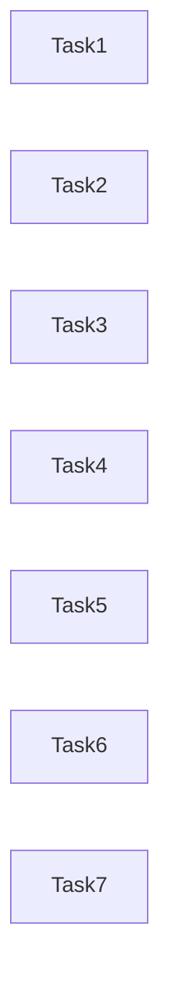

# 领域偏离修批方案（ADR-013 + Drift Audit）v2

> **For agentic workers:** REQUIRED WORKFLOW: implement **one task at a time** with review gates. Steps use checkbox (`- [ ]`).  
> **取代：**  
> - [`2026-10-01-uat-domain-aligned-residue-fix.md`](./2026-10-01-uat-domain-aligned-residue-fix.md)（作废）  
> - 本文件 v1 草稿（有 Task 交叉依赖——已作废，以本 v2 为准）  
> **权威设计：** [`ADR-013`](../../decisions/013-partner-busy-and-silent-channel.md) · `02-domain-model.md` §4.12  
> **偏离审计：** [`domain-design-impl-drift-audit-2026-10-01.md`](../../audits/domain-design-impl-drift-audit-2026-10-01.md)  
> **调研：** [`research-busy-scope-interrupt-vs-queue-2026-10-01.md`](../../audits/research-busy-scope-interrupt-vs-queue-2026-10-01.md)  
> **须独立 Audit PASS 后方可开修。**

**Goal:** 收齐漂移审计 P0/P1（及文档 P2），使实现与 ADR-013 / §3.6 / §4.10 对齐；关单复测只记（ADR-012）。

**Architecture（任务独立性硬规则）：**

1. **每个 Task 自包含**：只改本 Task「Files / 独占区」列出的路径与行块；Done when / Commit 不引用其它 Task 编号。  
2. **禁止**「依赖 Task N / 先做完 Task N」——若语义必须同批落地，**合并进同一 Task**（见 Task 2）。  
3. **禁止**两 Task 改同一函数的同一分支；`ConversationPanel.tsx` 按**独占区**划分（见下表）。  
4. 推荐执行顺序仅作排期提示，**不是**依赖边；可并行开不同 Task（不同独占区）。

| Task | 独占区（互不交叉） |
|------|-------------------|
| 1 ask_user 索引 | `candidates.ts` + Panel **ask_user / candidates 的 `replied=` 两处** |
| 2 ADR-013 产品 | Panel **`send` / `stopGeneration` / escalate 调用点 / `doneNotifier`·`runChat` busy 释放**；可选 `busyGate.ts` 新文件 |
| 3 start-server 文案 | **仅** `gateway.ts` + `serviceManager.ts` + 其单测 |
| 4 确认卡触发 | Panel **确认卡渲染块**（`nf-confirmcard` / goal·plan·resolution 显示条件） |
| 5 gate 文档 | **仅** `docs/domain/**` |
| 6 UAT harness | **仅** `scripts-cdp/uat-lib.mjs` |
| 7 复测 | **仅** `docs/audits/uat-domain-drift-remeasure-*.md` + dist/跑测（不改产品） |

**Tech Stack:** Electron/React · Vitest · Playwright interaction · Mac UAT · ADR-012/013

## Global Constraints

- ADR-012：Tasks 1–6 改码；Task 7 **只记复测**；未达标停等裁决  
- ADR-013 正文不改；本批落地 Consequences  
- **不扩** `SERVER_COMMAND_WHITELIST`；不恢复 `tool_choice:required`  
- 不缩池 / 不去 `rejectPlan` / 不取消 `refuse_once`  
- 关单硬闸：`pass≥10/12` ∧ `收口失败=0` ∧ `环境失败≤2` ∧ T1–T4 全绿  
- 实施勿改本 plan（审计回写除外）

## Drift → Task（一对一，无交叉）

| Drift ID | Task | 交付物一句话 |
|----------|------|--------------|
| P0 G-ask-index | **1** | ask_user「已回复」按消息下标 |
| P0 C-silent + P0 C-working + P1 B-escalate | **2** | 单 Task 落地 ADR-013 产品三刀（合并，避免半成品） |
| P1 H-start-server-desc | **3** | 文案/拒错指 open；不扩白名单 |
| P1 A-text-card | **4** | 弹卡仅 pending+decisionContent |
| P2 I-gate.denied | **5** | 文档改名 tool.blocked |
| P0 C-uat-busy | **6** | harness busy→continue + forcedcard |
| 关单 | **7** | 复测审计只记 |



（无箭头＝无依赖。建议排期：1∥3∥5 → 2∥4 → 6 → 7。）

---

### Task 1 — ask_user「已回复」按消息下标（P0 G）

**目标：** 后发 `ask_user` 选项不被会话早先用户消息标成「已回复」。

**Files（独占）：**
- Modify: `apps/desktop/src/renderer/candidates.ts`（新增导出）
- Modify: `apps/desktop/src/renderer/ConversationPanel.tsx`  
  - **仅** candidates 块内 `replied=`（约 L2871）  
  - **仅** ask_user 块内 `replied=`（约 L3245）及该 IIFE；`toolCalls.map((tc, i)` 内参数改名为 `(tc, _ti)` 避免阴影  
- Test: `apps/desktop/tests/unit/candidates.test.ts`  
- Test: `apps/desktop/tests/interaction/cards-from-decision-content.interaction.ts`（追加一测）

**不改：** `send` / `stopGeneration` / 确认卡显示条件 / gateway / uat-lib。

**Interfaces:**
- Produces: `hasUserReplyAfter(messages: ReadonlyArray<{ role: string }>, messageIndex: number): boolean`

- [ ] **Step 1: 写失败单测**

在 `candidates.test.ts` 追加：

```ts
import { hasUserReplyAfter } from '../../src/renderer/candidates'

describe('hasUserReplyAfter', () => {
  const msgs = [
    { role: 'user' },
    { role: 'assistant' },
    { role: 'user' },
    { role: 'assistant' },
  ]
  it('后发消息下标 3：其后无 user → false', () => {
    expect(hasUserReplyAfter(msgs, 3)).toBe(false)
  })
  it('旧 bug：用 toolCall 下标 0 slice messages → 假阳性', () => {
    expect(msgs.slice(0 + 1).some((m) => m.role === 'user')).toBe(true)
  })
  it('下标 3 之后出现 user → true', () => {
    expect(hasUserReplyAfter([...msgs, { role: 'user' }], 3)).toBe(true)
  })
})
```

- [ ] **Step 2: 跑测须 FAIL**

```bash
cd apps/desktop && npx vitest run tests/unit/candidates.test.ts -t hasUserReplyAfter
```

Expected: FAIL（未导出）

- [ ] **Step 3: 实现纯函数（`candidates.ts` 文件末尾）**

```ts
/** 本消息之后是否已有用户消息——ask_user / <candidates> 共用「已回应」判定 */
export function hasUserReplyAfter(
  messages: ReadonlyArray<{ role: string }>,
  messageIndex: number,
): boolean {
  if (messageIndex < 0 || messageIndex >= messages.length) return false
  return messages.slice(messageIndex + 1).some((m) => m.role === 'user')
}
```

- [ ] **Step 4: 接线 ConversationPanel（仅 replied 两行）**

外层已是 `messages.map((m, i) => …)`：

```tsx
// candidates 块
const replied = hasUserReplyAfter(messages, i)

// ask_user：在 m.toolCalls.map((tc, _ti) => { … })
const replied = hasUserReplyAfter(messages, i) // i = 消息下标，非 _ti
```

顶部增加：`import { …, hasUserReplyAfter } from './candidates'`（与现有 candidates import 合并）。

- [ ] **Step 5: 单测 PASS**

```bash
npx vitest run tests/unit/candidates.test.ts -t hasUserReplyAfter
```

- [ ] **Step 6: Interaction**

在 `cards-from-decision-content.interaction.ts` 追加（`chunk.content` 非 `chunk.text`）：

```ts
test('ask_user：后发澄清不被早先用户消息标成已回复', async ({ page }) => {
  const h = await installMockBridge(page, { project: 'open', manualEmit: true })
  await enterWorkspace(page)
  await sendChat(page, '先聊一句')
  await h.emit([chunk.content('收到'), chunk.done()])
  await sendChat(page, '再问选型')
  await h.emit([
    toolCall.askUser('选哪边？', 'approach_choice', [
      { label: '方案甲', description: 'a' },
      { label: '方案乙', description: 'b' },
    ]),
    chunk.done(),
  ])
  const btn = page.locator('.nf-candidates__btn', { hasText: '方案甲' })
  await expectVisible(btn, 10000)
  await expect(btn).not.toContainText('已回复')
  await expect(btn).toBeEnabled()
  await btn.click()
  await expectText(page.locator('.nf-msg--user').last(), '方案甲', 10000)
})
```

```bash
npx playwright test --project=interaction tests/interaction/cards-from-decision-content.interaction.ts -g "后发澄清"
```

- [ ] **Step 7: Commit**

```bash
git add apps/desktop/src/renderer/candidates.ts \
  apps/desktop/src/renderer/ConversationPanel.tsx \
  apps/desktop/tests/unit/candidates.test.ts \
  apps/desktop/tests/interaction/cards-from-decision-content.interaction.ts
git commit -m "$(cat <<'EOF'
fix: ask_user replied state uses message index

ToolCall index was sliced against messages[], marking later clarify
options as already answered before any click on that card.
EOF
)"
```

**Done when:** 上列测绿；`rg "messages\.slice\(i \+ 1\)" ConversationPanel.tsx` 在 ask_user 块已消失（改为 `hasUserReplyAfter`）。

---

### Task 2 — ADR-013 产品面：silent 排队 + 显式恢复打断 + working 全回合（P0 C + P1 B）

**目标：** 一次交齐 ADR-013 三条 Consequences，避免「只改 silent 排队、escalate 半残」。本 Task **内部**可分 Step，对外仍是**一个**可审交付。

**Files（独占区——勿改 Task 1/4 的 replied / 确认卡显示条件）：**
- Create: `apps/desktop/src/renderer/busyGate.ts`（纯函数，便于单测）
- Modify: `ConversationPanel.tsx`  
  - `send` 内 `workingRef` 分支（约 L2411–2424）  
  - `stopGeneration` 签名与 tlog source（约 L2370–2383）  
  - StuckDetector `escalate` 调用（约 L1409–1412）  
  - `doneNotifierRef` / `runChat` 尾部与「及时释放 working」相关（约 L1479、L2204–2213、L2581–2585）  
  - **不改** ask_user/candidates `replied`；**不改** `nf-confirmcard` 的 show 条件  
- Modify: `apps/desktop/src/domain/timeline.ts`——若 `conversation.interrupted` 的 detail 有 source 枚举注释，补 `recovery`  
- Test: `apps/desktop/tests/unit/busyGate.test.ts`  
- Test: 既有 stuck escalate interaction（`cards-from-decision-content` 或 agentLoop 相关）——断言 interrupted source≠默认 silent 打断路径

#### 2A — `busyGate` 纯函数

- [ ] **Step 1: 失败单测 `busyGate.test.ts`**

```ts
import { describe, it, expect } from 'vitest'
import { shouldQueueWhileBusy } from '../../src/renderer/busyGate'

describe('shouldQueueWhileBusy (ADR-013)', () => {
  it('busy + silent → queue', () => {
    expect(shouldQueueWhileBusy({ working: true, silent: true, pending: 'none' })).toBe(true)
  })
  it('busy + user → queue', () => {
    expect(shouldQueueWhileBusy({ working: true, silent: false, pending: 'none' })).toBe(true)
  })
  it('busy + user + approval pending → 不排队（直送例外）', () => {
    expect(shouldQueueWhileBusy({ working: true, silent: false, pending: 'approval' })).toBe(false)
  })
  it('busy + silent + approval → 仍排队（silent 不走授权直送）', () => {
    expect(shouldQueueWhileBusy({ working: true, silent: true, pending: 'approval' })).toBe(true)
  })
  it('not working → 不排队', () => {
    expect(shouldQueueWhileBusy({ working: false, silent: true, pending: 'none' })).toBe(false)
  })
})
```

- [ ] **Step 2: 实现 `busyGate.ts`**

```ts
export type BusyPending = 'none' | 'goal' | 'plan' | 'resolution' | 'approval' | 'system_clarify' | string

export function shouldQueueWhileBusy(opts: {
  working: boolean
  silent: boolean
  pending: BusyPending
}): boolean {
  if (!opts.working) return false
  // ADR-013：待授权时仅「非 silent 用户发送」直送；其余 busy 一律排队
  if (!opts.silent && opts.pending === 'approval') return false
  return true
}
```

- [ ] **Step 3: Vitest PASS** `npx vitest run tests/unit/busyGate.test.ts`

#### 2B — `send`：废除 silent→stopGeneration

- [ ] **Step 4: 改 `send` 的 working 分支**

删除：

```ts
if (silent) {
  await stopGeneration('silent')
  …
}
```

改为（伪代码对齐现结构）：

```ts
if (workingRef.current) {
  if (shouldQueueWhileBusy({
    working: true,
    silent,
    pending: stateRef.current.pending,
  })) {
    console.log('[conversation] busy——排队衔接（ADR-013；要停请点停止）')
    pendingSendRef.current = text
    // silent：不在此处 push 用户气泡；flush 后 send 再走 silent 系统通道
    return
  }
  // 未排队：仅「working + 非 silent + pending===approval」落入既有直送逻辑
}
```

`flushPendingSend` 保持：`sendRef.current({ text: pending })`——flush 时若文本是系统前缀，`isSystemNudgeText` 仍会 silent。

#### 2C — escalate → `recoverInterrupt`

- [ ] **Step 5: 扩展停止源 + recoverInterrupt**

```ts
const stopGeneration = async (source: 'button' | 'recovery' = 'button') => {
  tlog('conversation.interrupted', { source }, 'system')
  // …其余同现（sessionRef++ / cancel / setWorking false）
}

const recoverInterrupt = async (opts: { text: string; reason: string }) => {
  tlog('conversation.interrupted', { source: 'recovery', reason: opts.reason }, 'system')
  await stopGeneration('recovery')
  void sendRef.current?.({ silent: true, text: opts.text })
}
```

若 timeline 对 detailKeys 校验 `source`，在 `timeline.ts` 注释/校验允许 `recovery`（及可选 `reason`）。

escalate 处（约 L1409–1412）：

```ts
if (event?.type === 'escalate') {
  tlog('stuck.escalated', { message: event.message }, 'system')
  onActionPromiseHint?.(null)
  void recoverInterrupt({ text: event.message, reason: 'stuck.escalate' })
}
```

**禁止** escalate 再写 `send({ silent: true, … })` 而不经 `recoverInterrupt`。

#### 2D — working 覆盖在飞回合

- [ ] **Step 6: 去掉「流式 done 提前释放 working 供快速确认」**

1. `rg -n "及时释放 working|快速确认推进" apps/desktop/src/renderer/ConversationPanel.tsx`  
2. 凡 doneNotifier / 注释意图为「释放 working 好点确认」而工具链未停者：改为 **不** `setWorking(false)`。  
3. **保留** maybeContinue 在 `shouldStopContinuation`（确认/授权）时 `releaseWorking()`——decision-pending＝非 busy（ADR-013）。  
4. **保留** `send` finally 在 `runChat`（含 maybeContinue）返回后 `setWorking(false)` + `flushPendingSend()`。  
5. 确认：`runChat` 在工具仍 pending 时不会在 finally 之前错误返回；若 doneNotifier 只用于解除「等首包」，不得清 busy。

- [ ] **Step 7: 静态核对**

```bash
rg -n "stopGeneration\\('silent'\\)|source: 'silent'" apps/desktop/src/renderer/ConversationPanel.tsx
# Expected: 无（或仅历史注释）
rg -n "recoverInterrupt|shouldQueueWhileBusy" apps/desktop/src/renderer/ConversationPanel.tsx
rg -n "及时释放 working|快速确认推进" apps/desktop/src/renderer/ConversationPanel.tsx
# Expected: 0 或改为 ADR-013 指针句
```

- [ ] **Step 8: 跑相关测**

```bash
npx vitest run tests/unit/busyGate.test.ts
npx playwright test --project=interaction -g "escalate|卡住|stuck" 
# 若无精确 -g，跑既有 S5 escalate 相关 interaction 文件中断言 stuck.escalated 的用例
```

- [ ] **Step 9: Commit（单 commit 交付本 Task）**

```bash
git add apps/desktop/src/renderer/busyGate.ts \
  apps/desktop/tests/unit/busyGate.test.ts \
  apps/desktop/src/renderer/ConversationPanel.tsx \
  apps/desktop/src/domain/timeline.ts
git commit -m "$(cat <<'EOF'
fix: ADR-013 busy queue, recoverInterrupt, full-turn working

Silent inject queues while working; escalate stops via recovery
source; working stays true until tool/continue chain yields.
EOF
)"
```

**Done when:** `shouldQueueWhileBusy` 测绿；无 `stopGeneration('silent')`；escalate 经 `recoverInterrupt`；「及时释放 working」意图路径已按 ADR-013 收口。

---

### Task 3 — start-server 文案分流（P1 H）

**目标：** 模型不再被「打开网页前用它」拐去 start-server 传 python；白名单不变。

**Files（独占——禁止改 renderer / uat）：**
- `apps/desktop/src/main/serviceManager.ts`
- `apps/desktop/src/main/gateway.ts`（仅 `start-server` 的 `description` 字符串）
- `apps/desktop/tests/unit/serviceManager.test.ts`

- [ ] **Step 1: 失败单测**

```ts
import { isServerCommand, startServerRejectReason } from '../../src/main/serviceManager'

it('python http.server 仍非 isServerCommand', () => {
  expect(isServerCommand('python3 -m http.server 8080')).toBe(false)
})

it('startServerRejectReason 含 open 与 vite/npm', () => {
  const err = startServerRejectReason('python3 -m http.server')
  expect(err).toMatch(/open/)
  expect(err).toMatch(/vite|npm run dev/)
  expect(err).toContain('python3 -m http.server')
})
```

- [ ] **Step 2: FAIL → 实现**

```ts
export function startServerRejectReason(rawCmd: string): string {
  return (
    `start-server 只支持开发服务器命令（npx vite / npm run dev 等）——不支持「${rawCmd}」。` +
    `静态 HTML 请用 open（如 index.html）；需要 HTTP 开发服请用 vite / npm run dev`
  )
}
```

`startServer` 内 `error: startServerRejectReason(rawCmd)`。

gateway `start-server` description 改为：

```ts
description:
  '启动开发服务器（NeonForge 管理进程——自动分配端口并记住地址）。仅用于 Node/Vite 类命令（npx vite / npm run dev / pnpm dev / yarn dev 等）。静态 HTML 不要用本工具——用 open（项目内路径如 index.html）。勿传 python -m http.server / php -S。',
```

- [ ] **Step 3: PASS** `npx vitest run tests/unit/serviceManager.test.ts`

- [ ] **Step 4: Commit**

```bash
git add apps/desktop/src/main/serviceManager.ts \
  apps/desktop/src/main/gateway.ts \
  apps/desktop/tests/unit/serviceManager.test.ts
git commit -m "$(cat <<'EOF'
fix: steer static HTML to open; keep start-server whitelist strict
EOF
)"
```

**Done when:** 单测绿；description 无「打开网页前用它」；`isServerCommand('python3 -m http.server')===false`。

---

### Task 4 — 确认卡仅领域派生触发（P1 A）

**目标：** 纯文本征询不再单独弹确认卡；只有 `pending` + `decisionContent.kind` 弹卡。

**Files（独占区）：**
- `ConversationPanel.tsx` **仅**确认卡渲染段（约 L2886–3175：`nf-confirmcard` / goal·plan·resolution 的 show 条件）  
- 相关 interaction 测（若断言依赖文本兜底弹卡则改测，不改 mock 协议路径）

**不改：** `send` / ask_user / deriveDecisionPoint done 路径（done 路径已用 derive——本 Task 只收渲染触发）。

- [ ] **Step 1: 定位当前 show 条件**

确认仍存在类似：

- `goalFallback = !goalConfirmed && isLastAssistant && goalFallbackTrigger(m.content)`  
- `execFallback = pendingCardToShow(…, m.content, …)`  

并作为卡显示条件之一。

- [ ] **Step 2: 改显示条件（钉死）**

```tsx
const dc = stateRef.current.decisionContent
const pending = stateRef.current.pending

const showGoalCard =
  pending === 'goal' && dc?.kind === 'goal' && isLastAssistant /* 或挂信号消息的既有定位 */

const showPlanCard =
  pending === 'plan' && dc?.kind === 'plan' && isLastAssistant

const showResolutionCard =
  pending === 'resolution' && dc?.kind === 'resolution' && isLastAssistant
```

- **删除** `goalFallback &&` / `execFallback &&` 作为 show 的充分条件。  
- `goalFallbackTrigger` / `pendingCardToShow` 可留作死代码删除或仅测用——生产渲染路径零引用。

- [ ] **Step 3: Interaction**

- 协议 `propose_goal` → 仍见「确认目标」  
- 纯助理文本含「等你确认」但无 decisionContent/pending → **不见**确认卡  

按仓库既有 helper 写测或改现测。

- [ ] **Step 4: Commit**

```bash
git commit -m "$(cat <<'EOF'
fix: show confirm cards only from pending decisionContent
EOF
)"
```

**Done when:** 生产路径 show 条件不含 `goalFallbackTrigger` / 文本 `pendingCardToShow` 真值；协议弹卡测绿。

---

### Task 5 — 文档：`gate.denied` → `tool.blocked`（P2 I）

**Files（独占——仅 docs）：**
- `docs/domain/00-domain-authority.md`（及 `rg gate.denied docs/` 命中处）

- [ ] **Step 1:**

```bash
rg -n "gate\.denied" docs/
```

- [ ] **Step 2:** 改为实际事件名 `tool.blocked`（可脚注：历史文稿曾写 gate.denied）。**不改** `apps/` 代码。

- [ ] **Step 3: Commit** `docs: rename gate.denied to tool.blocked in domain authority`

**Done when:** `rg gate.denied docs/` 为 0（或仅 ADR/审计历史引用）。

---

### Task 6 — UAT harness：busy continue + forcedcard（P0 C-uat）

**目标：** 人格在「搭档处理中」时不点决策、不发 nudge；强制澄清卡与方案「确认执行」分流。

**Files（独占——仅 harness）：**
- `apps/desktop/scripts-cdp/uat-lib.mjs`（`autopilot`）

**不改：** 产品 renderer（可与 Task 2 并行；本 Task 用 UI 文案探测 busy，与现正则一致）。

- [ ] **Step 1: Helpers（`autopilot` 上方）**

```js
async function isModelBusy(page) {
  try {
    const uiBusy = await dump(page)
    return /搭档处理中|处理中|思考中|生成中|正在回复|Streaming/i.test(uiBusy)
  } catch {
    return false
  }
}

async function forcedCardVisible(page) {
  try {
    return (await page.locator('.nf-forcedcard').count()) > 0
  } catch {
    return false
  }
}
```

- [ ] **Step 2: 唯一控制流（钉死——禁止半门闩）**

在扫完 `labels` / `deadConfirmLock` 解锁之后、**任何** `acted` / `typeAndSend` 之前：

```js
const busy = await isModelBusy(page)
if (busy) {
  console.log(`  r${r}: skip-act+nudge modelBusy`)
  stuckIdle = 0
  continue
}

let acted = null
let fpBeforeConfirm = ''
const forced = await forcedCardVisible(page)

if (forced) {
  const stillRejecting =
    (persona.rejectPlan || 0) > 0 && (persona.__planRejects || 0) < (persona.rejectPlan || 0)
  if (stillRejecting) {
    const no = page.locator('.nf-forcedcard .nf-forcedcard__btn', { hasText: '我要重新描述' })
    if (await no.count()) {
      await no.click()
      acted = 'button:forced-reject'
      persona.__planRejects = (persona.__planRejects || 0) + 1
    }
  } else {
    const ok = page.locator('.nf-forcedcard .nf-forcedcard__btn--ok')
    if (await ok.count()) {
      await ok.click()
      acted = 'button:forced-confirm'
    }
  }
}

// 原「重试」与方案卡早段 getByRole('确认执行')：加 !forced
// 原全部 if (!acted) nudge / after-miss / 探询：因 continue，busy 时不可达
```

- [ ] **Step 3: Done-when 静态核对**

```bash
rg -n "skip-act\\+nudge modelBusy" -A6 apps/desktop/scripts-cdp/uat-lib.mjs
# 6 行内须有 continue
rg -n "getByRole\\('button', \\{ name: '确认执行' \\}\\)" -B15 apps/desktop/scripts-cdp/uat-lib.mjs
# 前置条件含 !forced
```

- [ ] **Step 4: Commit**

```bash
git add apps/desktop/scripts-cdp/uat-lib.mjs
git commit -m "$(cat <<'EOF'
fix(uat): idle continue skips act+nudge; isolate forcedcard
EOF
)"
```

**Done when:** 上列 rg 通过；busy 分支无「只跳过 acted、仍跑 nudge」。

---

### Task 7 — dist + 复测（ADR-012 只记）

**Files（独占）：**
- Create: `docs/audits/uat-domain-drift-remeasure-2026-10-01.md`  
- 不改产品 / harness（若发现新 bug 只记）

- [ ] **Step 1: Mac dist**（与 v2 关单同一 build 入口；改过 main/renderer 后必重建）

- [ ] **Step 2: 复测**

```bash
cd apps/desktop
NF_UAT_SEED=pilot30 bash scripts-cdp/run-uat-persona-pool.sh
# T1–T4 既有入口
```

- [ ] **Step 3: 写审计表**

列：persona | terminal | ask 未点已回复? | busy 中确认词×2? | start-server 拒文含 open? | interrupted source=silent 仍现?

- [ ] **Step 4: 对照硬闸** — 未达标 → **停等裁决**（禁止本 Task 内开修）

- [ ] **Step 5: 若用户要求提交审计**

```bash
git add docs/audits/uat-domain-drift-remeasure-2026-10-01.md
git commit -m "$(cat <<'EOF'
docs: domain-drift UAT remasure (ADR-012 record-only)
EOF
)"
```

**Done when:** 审计文件落盘并汇报硬闸结果；非「测中连修」。

---

## Self-Review

1. 七 Task 文件/独占区无交叉；ADR-013 三刀合并为 Task 2 单交付。  
2. 无「依赖 Task N」语句；排期提示非依赖边。  
3. 每 Task 含完整测/rg/commit。  
4. 不扩白名单；ADR-012/013 遵守。

## 下一闸

独立 **Audit**（对象＝本 v2）→ PASS 后执行；推荐顺序 1∥3∥5 → 2∥4 → 6 → 7，可按独占区并行。
