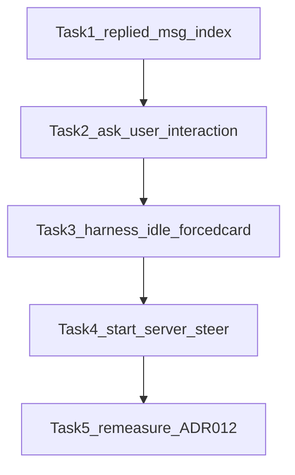

# UAT 残留叶因 · 领域对齐修批方案

> **For agentic workers:** REQUIRED WORKFLOW: implement task-by-task with review gates. Steps use checkbox (`- [ ]`).  
> **⛔ 作废（勿执行）：** 已被 [`2026-10-01-domain-drift-fix.md`](./2026-10-01-domain-drift-fix.md) 取代（ADR-013 产品面 + 全量 P0/P1 漂移）。本文件仅作历史。  
> **前置证据：** timeline 调研（ask_user `replied` 索引用错；harness 在 open `assistant_start` 上点强制澄清卡；start-server 拒 python 属领域分层非漏表）。  
> **不取代：** [`2026-09-30-uat-leaf-split-fix-v2.md`](./2026-09-30-uat-leaf-split-fix-v2.md)（已落地）；本计划只处置 **v2 复测后新确认的三条领域对齐叶因**。  
> **审计：** [`plan-audit-domain-aligned-residue-fix-2026-10-01.md`](../../audits/plan-audit-domain-aligned-residue-fix-2026-10-01.md) — R1 FAIL（Blocking 1 busy/nudge）→ **本版已回写吸收**；须再过 **Audit R2** 后方可开修。

**Goal:** 按领域模型修掉「选项提前已回复」「人格不等模型结束就决策」「start-server 误用静态服」三条残留，使澄清态、输入排队、服务工具边界与权威文档一致；复测只记不改（ADR-012）。

**Architecture:**

| 叶因 | 领域锚点 | 修向（钉死） |
|------|----------|--------------|
| A · ask_user「提前选好」 | UI 契约 / `<candidates>` 注释：「**本消息之后**出现用户消息＝已回应」；`ask_user` 与 candidates **同语义**（protocol 会话级澄清） | `replied` 必须用 **message 下标**，禁止用 `toolCalls.map` 的 `i` 去 `messages.slice` |
| B · 不等输出完就确认 | **ADR-013** / §4.12：**busy＝在飞回合（想+流+工具）**；用户与 silent 默认排队；打断仅停止。UAT＝真人等 idle | harness：`modelBusy` 与产品 busy 同源后 **`continue`**（acted+全部 typeAndSend 同禁）；`.nf-forcedcard` 与方案「确认执行」分流 |
| C · start-server × python | 02 §4.10：`isServerCommand`＝**严格白名单**；`isServerLikeCommand`＝bash 超时保护；静态 HTML → **`open`** | **不扩** 白名单；收紧 description + `startServerRejectReason` 重定向到 `open` / vite 类 |

**Tech Stack:** React renderer · `CandidateButtons` · `uat-lib.mjs` · `serviceManager` / `gateway` · Vitest · Playwright interaction · Mac UAT 复测 · ADR-012

## Global Constraints

- ADR-012：Tasks 1–4 改码；Task 5 **只记复测**；未达标停等用户裁决，禁止测中连修
- **不改** ADR-011 / 不拆 unverifiable / **不恢复** `tool_choice:required`
- **不扩** `SERVER_COMMAND_WHITELIST` 到 python/php/http-server（与 §4.10「严格白名单」同向；扩表须另开设计单含端口规范化 + URL 解析）
- 不缩池 / 不去 `rejectPlan` / 不取消 `refuse_once` / 不去 `ask_what`
- nudge 保持 `silent: true`；禁止加大 `maxRounds` 熬绿
- **Task 3 硬约束（R1 B1）：** `modelBusy` → `continue`（acted **与** 全部 `typeAndSend` 同禁）；半门闩（只挡点击不挡 nudge）＝方案违规
- 关单硬闸（继承 v2）：`pass≥10/12` ∧ `收口失败=0` ∧ `环境失败≤2` ∧ T1–T4 全绿；`web_env`/`config` ≠ PASS
- 实施时不要编辑本 plan（用户明示审计回写除外）；**Audit R2 PASS 前不开修**



## 叶因 → 任务

| 叶因 | 证据摘要 | Task |
|------|----------|------|
| A | `toolCalls.map((tc,i)` → `messages.slice(i+1)`；后期 ask 零 option 点击却「已回复」 | 1–2 |
| B | p002/p114：2nd「确认，目标清楚了」来自 `system_clarify`，`open=[assistant_start…]`；`modelBusy` 只喂 stuckIdle | 3 |
| C | 拒 `python -m http.server` 符合严格白名单；gateway 文案「打开网页前用它」过宽拐弯 | 4 |
| — | 关单 | 5 |

## File Structure

| 文件 | 职责 |
|------|------|
| `apps/desktop/src/renderer/candidates.ts`（或同目录新纯函数） | `hasUserReplyAfter(messages, messageIndex)` 单测友好 |
| `apps/desktop/src/renderer/ConversationPanel.tsx` | ask_user `replied` 改用 **message** 下标 |
| `apps/desktop/tests/unit/candidates.test.ts`（或新 `replyState.test.ts`） | 索引语义单测 |
| `apps/desktop/tests/interaction/cards-from-decision-content.interaction.ts` | 后发 ask_user 不因早先用户消息预「已回复」 |
| `apps/desktop/scripts-cdp/uat-lib.mjs` | idle 门闩 + forcedcard 分流 |
| `apps/desktop/src/main/gateway.ts` | start-server description 收紧 |
| `apps/desktop/src/main/serviceManager.ts` | 拒错文案重定向 |
| `apps/desktop/tests/unit/serviceManager.test.ts` | 拒错文案断言（白名单仍拒 python） |
| `docs/audits/uat-persona-pool-domain-residue-remeasure-2026-10-01.md` | Task 5 只记 |

---

### Task 1 — 澄清「已回应」索引：纯函数 + ask_user 接线（产品）

**领域契约：** 与 `<candidates>` 注释一致——「候选/**ask_user 选项**之后出现用户消息（点选或打字）＝已回应」。参照物是 **承载该澄清的 assistant 消息** 在 `messages[]` 中的下标，不是 toolCall 在 `m.toolCalls[]` 中的下标。

**Files:**
- Modify: `apps/desktop/src/renderer/candidates.ts`（导出纯函数；若更愿新建 `replyState.ts` 亦可，但须单源被 candidates 与 ask_user 共用）
- Modify: `apps/desktop/src/renderer/ConversationPanel.tsx`（ask_user 块 + 可选：candidates 块改调同一函数）
- Test: `apps/desktop/tests/unit/candidates.test.ts`（或 `replyState.test.ts`）

**Interfaces:**
- Produces: `hasUserReplyAfter(messages: ReadonlyArray<{ role: string }>, messageIndex: number): boolean`
- Consumes: `messages` 全表 + **外层** `messages.map((m, msgIdx) => …)` 的 `msgIdx`

- [ ] **Step 1: Write the failing test**

```ts
import { describe, it, expect } from 'vitest'
import { hasUserReplyAfter } from '../../src/renderer/candidates' // 或 replyState

describe('hasUserReplyAfter（澄清已回应——按消息下标）', () => {
  const msgs = [
    { role: 'user' }, // 0 首轮诉求
    { role: 'assistant' }, // 1 首 ask / candidates
    { role: 'user' }, // 2 用户已答首澄清
    { role: 'assistant' }, // 3 后发 ask_user（toolCall i 常为 0）
  ]

  it('后发澄清消息：其后尚无 user → 未回应（即使 toolCall 下标为 0）', () => {
    expect(hasUserReplyAfter(msgs, 3)).toBe(false)
  })

  it('误用 toolCall 下标 0 去 slice messages → 会假阳性（本测锁定反例语义）', () => {
    // 文档化 bug：messages.slice(0+1) 会扫到 msgs[2]
    expect(msgs.slice(0 + 1).some((m) => m.role === 'user')).toBe(true)
    expect(hasUserReplyAfter(msgs, 3)).toBe(false)
  })

  it('澄清消息之后出现 user → 已回应', () => {
    const after = [...msgs, { role: 'user' }]
    expect(hasUserReplyAfter(after, 3)).toBe(true)
  })
})
```

- [ ] **Step 2: Run test to verify it fails**

Run（cwd `apps/desktop`）: `npx vitest run tests/unit/candidates.test.ts`（或新文件）  
Expected: FAIL — `hasUserReplyAfter` 未导出

- [ ] **Step 3: Minimal implementation**

```ts
/** 本消息（messageIndex）之后是否已有用户消息——ask_user / <candidates> 共用「已回应」判定 */
export function hasUserReplyAfter(
  messages: ReadonlyArray<{ role: string }>,
  messageIndex: number,
): boolean {
  if (messageIndex < 0 || messageIndex >= messages.length) return false
  return messages.slice(messageIndex + 1).some((m) => m.role === 'user')
}
```

`ConversationPanel.tsx` ask_user 块（在 `messages.map((m, i)` 内、`m.toolCalls.map((tc, ti)` 内）：

```tsx
// ❌ 禁止：messages.slice(i + 1) 且 i 来自 toolCalls.map
// ✅ 必须：外层消息下标 i（或 msgIdx）
const replied = hasUserReplyAfter(messages, i)
```

`toolCalls.map` 参数改名避免阴影：`(tc, _ti)`。  
candidates 块改为 `hasUserReplyAfter(messages, i)`（行为不变，单源）。

- [ ] **Step 4: Run test to verify it passes**

Run: `npx vitest run tests/unit/candidates.test.ts`  
Expected: PASS

- [ ] **Step 5: Commit**

```bash
git add apps/desktop/src/renderer/candidates.ts \
  apps/desktop/src/renderer/ConversationPanel.tsx \
  apps/desktop/tests/unit/candidates.test.ts
git commit -m "$(cat <<'EOF'
fix: ask_user replied state uses message index

ToolCall index was sliced against messages[], marking later clarify
options as already answered before any click on that card.
EOF
)"
```

---

### Task 2 — Interaction：后发 ask_user 不被早先用户消息毒成「已回复」

**Files:**
- Modify: `apps/desktop/tests/interaction/cards-from-decision-content.interaction.ts`
- Consumes: Task 1 `hasUserReplyAfter` 接线

- [ ] **Step 1: Write the failing interaction（若 Task1 未接线则红）**

在既有 `S3-4：ask_user 选项按钮化` 邻近追加：

```ts
test('ask_user：后发澄清不被会话早先用户消息标成已回复', async ({ page }) => {
  const h = await installMockBridge(page, { project: 'open', manualEmit: true })
  await enterWorkspace(page)
  await sendChat(page, '先聊一句')
  await h.emit([chunk.content('收到'), chunk.done()]) // mockBridge：chunk.content，非 chunk.text
  // 第二轮：新的 ask_user（会话中已有 user 消息——旧 bug 会整组「已回复」）
  await sendChat(page, '再问选型')
  await h.emit([
    toolCall.askUser('选哪边？', 'approach_choice', [
      { label: '方案甲', description: 'a' },
      { label: '方案乙', description: 'b' },
    ]),
    chunk.done(),
  ])
  const btn = page.locator('.nf-candidates__btn', { hasText: '方案甲' })
  await expectVisible(btn, 10000)
  // 必须仍可点——文案不得含「已回复」
  await expect(btn).not.toContainText('已回复')
  await expect(btn).toBeEnabled()
  await btn.click()
  await expectText(page.locator('.nf-msg--user').last(), '方案甲', 10000)
})
```

（`chunk` / `toolCall` / `expectVisible` / `enterWorkspace` / `sendChat` 均来自同文件既有 helper / `mockBridge.ts`。）

- [ ] **Step 2: Run interaction project**

Run: `npx playwright test --project=interaction tests/interaction/cards-from-decision-content.interaction.ts -g "后发澄清"`  
Expected: Task1 未合入时 FAIL（按钮已回复/disabled）；合入后 PASS

- [ ] **Step 3: Commit**

```bash
git add apps/desktop/tests/interaction/cards-from-decision-content.interaction.ts
git commit -m "$(cat <<'EOF'
test: later ask_user options stay clickable after prior user turns
EOF
)"
```

---

### Task 3 — Harness：等模型空闲再决策 + 强制澄清卡分流

**领域契约：**
- §4.12：模型产出中 → 用户输入排队；UAT 人格＝不插队点确认、不插队发 nudge
- ADR-010：`system_clarify` 包装决策点；UI＝`.nf-forcedcard`；主钮文案也是「确认执行」——**不得**与方案卡全局 `getByRole('确认执行')` 混点

**Files:**
- Modify: `apps/desktop/scripts-cdp/uat-lib.mjs`（`autopilot`）

**策略（钉死 —— Audit R1 Blocking 1 吸收）：**

1. 扫钮/`labels`/`has`/`deadConfirmLock` 解锁逻辑照旧跑完后，立刻算 `busy = await isModelBusy(page)`（正则不变：`搭档处理中|处理中|思考中|生成中|正在回复|Streaming`）。
2. **唯一控制流（选定 `(a)`，禁止只挡 acted、不挡 nudge）：**
   ```js
   if (busy) {
     console.log(`  r${r}: skip-act+nudge modelBusy`)
     stuckIdle = 0
     // 不累 idleRounds（避免 busy 空转把 nudge 阈值攒满，空闲首轮立刻乱发）
     continue
   }
   // —— 以下整段（acted + after-miss + boundary/web/scope 探询 + 全部 if(!acted) nudge）仅在 !busy ——
   ```
   `continue` 必须出现在 **任何** `personaAct` / `clickButton` / `getByRole(…).click` / `typeAndSend` **之前**（含 L673–699 早段方案卡、L717+ clarify、L774 after-miss、L799+ 探询、L869+ nudge 全家）。
3. **forcedcard 分流（仅 `!busy` 路径内，且须在早段 `getByRole('确认执行')` 之前）：**
   ```js
   let acted = null
   let fpBeforeConfirm = ''
   const forced = await forcedCardVisible(page)
   if (forced) {
     // 默认确认；若人格仍在 rejectPlan 配额内且 underlying 像方案协商——点「我要重新描述」
     // （第三钮「由搭档全权决定」本批不点，除非后续证据要求）
     const stillRejecting =
       (persona.rejectPlan || 0) > 0 && (persona.__planRejects || 0) < (persona.rejectPlan || 0)
     if (stillRejecting) {
       const no = page.locator('.nf-forcedcard .nf-forcedcard__btn', { hasText: '我要重新描述' })
       if (await no.count()) {
         await no.click()
         acted = 'button:forced-reject'
         persona.__planRejects = (persona.__planRejects || 0) + 1
       }
     } else {
       const ok = page.locator('.nf-forcedcard .nf-forcedcard__btn--ok')
       if (await ok.count()) {
         await ok.click()
         acted = 'button:forced-confirm'
       }
     }
     // 不清、不重设 __goal_done__（已设保持）
   }
   if (!acted && has('重试') && (await clickButton(page, '重试'))) acted = 'button:重试'
   // 早段方案卡（原 L673–699）：仅当 !forced —— 禁止全局 getByRole('确认执行') 点到强制卡
   if (
     !acted &&
     !forced &&
     sentTexts.has('__goal_done__') &&
     !planConfirmed &&
     !has('已解决') &&
     !has('允许执行') &&
     !has('允许并记住') &&
     !has('批准这批文件')
   ) {
     // …原 stillRejecting / deadConfirmLock / getByRole('确认执行'|'修改方案') 逻辑不变…
   }
   // 其后原 has('已解决') / 授权 / 确认目标 / has('确认执行') 分支：
   // 凡会点「确认执行」的路径同样加 !forced 守卫（或依赖 acted 已处理 forced 而跳过）
   ```
4. 原文件后半段 stuck 检测里的重复 `modelBusy` 计算可保留作 stuckIdle 辅助；**决策门闩以步骤 2 的 `continue` 为准**，不得再写成「busy 时只跳过 acted、仍进 nudge」。

- [ ] **Step 1: Helper（写进 uat-lib.mjs，`autopilot` 之上）**

```js
async function isModelBusy(page) {
  try {
    const uiBusy = await dump(page)
    return /搭档处理中|处理中|思考中|生成中|正在回复|Streaming/i.test(uiBusy)
  } catch {
    return false
  }
}

async function forcedCardVisible(page) {
  try {
    return (await page.locator('.nf-forcedcard').count()) > 0
  } catch {
    return false
  }
}
```

- [ ] **Step 2: 按上「唯一控制流」改 `autopilot`**

实现时对照：`continue` 一行必须在 `let acted = null` **之前**；forced 块必须在早段 `getByRole('确认执行')` **之前**；早段与后段方案确认均带 `!forced`。

- [ ] **Step 3: Done-when 静态核对（无 Mac）**

```bash
rg -n "skip-act\+nudge modelBusy|forcedCardVisible|nf-forcedcard|isModelBusy" \
  apps/desktop/scripts-cdp/uat-lib.mjs
# 1) busy 分支须含 continue（不止 log）
rg -n "skip-act\+nudge modelBusy" -A6 apps/desktop/scripts-cdp/uat-lib.mjs
# 2) 早段 getByRole('确认执行') 所在 if 条件须含 !forced（或等价）
rg -n "getByRole\('button', \{ name: '确认执行' \}\)" -B12 apps/desktop/scripts-cdp/uat-lib.mjs
```

Expected:
- `skip-act+nudge modelBusy` 后 **6 行内出现 `continue`**
- `getByRole(…确认执行)` 的前置条件含 `!forced`（或嵌在 `if (!forced)`）
- **禁止**出现「busy 时只跳过 acted、nudge 仍在 `if (!acted)` 无 busy 守卫」的半门闩

- [ ] **Step 4: Commit**

```bash
git add apps/desktop/scripts-cdp/uat-lib.mjs
git commit -m "$(cat <<'EOF'
fix(uat): idle continue skips act+nudge; isolate forcedcard clicks

Busy rounds must not typeAndSend nudges (Audit R1 B1). system_clarify
shares 确认执行 label — click only inside .nf-forcedcard when present.
EOF
)"
```

---

### Task 4 — start-server：描述与拒错对齐领域分流（不扩白名单）

**领域契约（02 §4.10）：**
- `start-server`＝托管 **开发服务器**（端口记忆 / PID / check/stop）
- `isServerCommand` 保持严格（vite / npm|pnpm|yarn run … / node server）
- 静态页打开＝`open`（项目内路径）；bash 起 python 服仅靠 `isServerLikeCommand` 防 30s 误杀——**不是** start-server 的命令选择范围

**Files:**
- Modify: `apps/desktop/src/main/gateway.ts`（`start-server` description）
- Modify: `apps/desktop/src/main/serviceManager.ts`（拒错文案）
- Test: `apps/desktop/tests/unit/serviceManager.test.ts`

- [ ] **Step 1: Failing test（只测导出纯函数 —— 禁止硬编码字符串自测恒绿）**

```ts
import {
  isServerCommand,
  startServerRejectReason, // 新增导出；本测 FAIL until implemented
} from '../../src/main/serviceManager'

it('isServerCommand：python http.server 仍拒（严格白名单——静态页走 open）', () => {
  expect(isServerCommand('python3 -m http.server 8080')).toBe(false)
  expect(isServerCommand('python -m http.server')).toBe(false)
})

it('startServerRejectReason：指引 open + vite/npm run dev（不扩白名单）', () => {
  const err = startServerRejectReason('python3 -m http.server')
  expect(err).toMatch(/open/)
  expect(err).toMatch(/vite|npm run dev/)
  expect(err).toContain('python3 -m http.server')
  expect(isServerCommand('python3 -m http.server')).toBe(false)
})
```

实现（零 spawn）：

```ts
export function startServerRejectReason(rawCmd: string): string {
  return (
    `start-server 只支持开发服务器命令（npx vite / npm run dev 等）——不支持「${rawCmd}」。` +
    `静态 HTML 请用 open（如 index.html）；需要 HTTP 开发服请用 vite / npm run dev`
  )
}
```

`startServer` 内：`error: startServerRejectReason(rawCmd)`（替换旧「只支持服务类命令…」句）。

- [ ] **Step 2: Run test FAIL then implement**

Run: `npx vitest run tests/unit/serviceManager.test.ts`  
Expected: 先 FAIL（`startServerRejectReason` 未导出）→ 实现后 PASS

- [ ] **Step 3: gateway description**

```ts
description:
  '启动开发服务器（NeonForge 管理进程——自动分配端口并记住地址）。仅用于 Node/Vite 类命令（npx vite / npm run dev / pnpm dev / yarn dev 等）。**静态 HTML 不要用本工具**——用 open（项目内路径如 index.html）。勿传 python -m http.server / php -S。',
```

- [ ] **Step 4: Commit**

```bash
git add apps/desktop/src/main/gateway.ts \
  apps/desktop/src/main/serviceManager.ts \
  apps/desktop/tests/unit/serviceManager.test.ts
git commit -m "$(cat <<'EOF'
fix: steer static HTML to open; keep start-server whitelist strict

Domain §4.10 separates managed dev servers from bash ServerLike
protection; reject copy and tool description must not invite python
http.server into start-server.
EOF
)"
```

---

### Task 5 — dist + 复测（ADR-012 只记）

**Files:**
- Create: `docs/audits/uat-persona-pool-domain-residue-remeasure-2026-10-01.md`

- [ ] **Step 1: build dist（Mac）** — 与 v2 关单同一入口（`apps/desktop` 既有 `npm run build` / 打包脚本；改 main/preload/renderer 后须重 build 再测）

- [ ] **Step 2: 复测**

```bash
# Mac；cwd apps/desktop；入口与 v2 关单一致
NF_UAT_SEED=pilot30 bash scripts-cdp/run-uat-persona-pool.sh
# 另跑 T1–T4（既有 split/leaf 入口，同 v2 Task 8）
```

- [ ] **Step 3: 写审计** — 表格列：persona / terminal / 是否再见「已回复」未点 / 是否 2×「确认，目标清楚了」且 open≠[] / start-server 拒文案是否含 open

- [ ] **Step 4: 对照硬闸** — 达标与否只汇报；**未达标 → 停，等裁决**（禁止本 Task 内开下一刀修）

- [ ] **Step 5: Commit 仅审计文档**（若用户要求提交）

```bash
git add docs/audits/uat-persona-pool-domain-residue-remeasure-2026-10-01.md
git commit -m "$(cat <<'EOF'
docs: domain-residue UAT remasure audit (ADR-012 record-only)
EOF
)"
```

---

## Self-Review（R1 回写后）

1. **Spec coverage：** A→T1/T2；B→T3；C→T4；关单→T5。无「顺手扩白名单」。
2. **R1 Blocking 1：** Task 3 选定 **`busy → stuckIdle=0 → continue`**，acted 与全部 `typeAndSend`（nudge/探询/after-miss）同禁；Done-when 要求 `continue` 可 `rg` 核对。
3. **R1 Nits：** `chunk.content`；早段 `getByRole(确认执行)` 纳入 `!forced`；Task4 删恒绿 tautology；forced 拒钮点明「我要重新描述」；A 锚点改 UI/candidates 契约。
4. **Type consistency：** `hasUserReplyAfter` · `startServerRejectReason` 贯穿对应 Task。
5. **未过 Audit R2 前禁止开修。**

## 下一闸

回写完毕 → 请跑 **Audit R2**（对象仍为本文件）。**R2 PASS 后**再选执行方式：

**1. Subagent-Driven（推荐）** · **2. Inline Execution**
